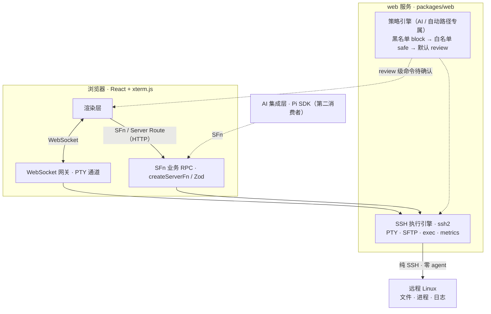

# SSH 可视化终端管理工具 · 技术架构

本文档定义项目的分层架构、模块组成与关键机制。接口清单、数据模型与实现契约见[详细设计](./08-详细设计.md)，技术决策见[决策记录](./决策记录.md)。

## 1 技术栈

| 层级 | 技术 | 说明 |
| --- | --- | --- |
| 运行时 | Node.js 22.5+ | web 服务独立运行（`node .output/server/index.mjs`），不依赖桌面壳 |
| 语言 | TypeScript v7（原生编译器 tsgo） | 全仓类型安全 |
| 全栈框架 | TanStack Start（`@tanstack/react-start`） | 文件路由 + SFn RPC + Server Route；Nitro 生产打包 |
| 通信范式 | SFn / Server Route + WebSocket | 业务 RPC 走 `createServerFn`；PTY 双向通道走 WebSocket；其余流式走 SFn |
| UI | Tailwind CSS v4 + shadcn/ui | 明暗双主题 token，`.dark` class 切换，预留多主题（「UI 方案」） |
| 表单 / 表格 | `@tanstack/react-form` / `@tanstack/react-table` | 连接表单与文件列表、审计日志、连接历史 |
| 日期 / 电子表格 | dayjs / hucre | 时间格式化 / 连接清单与审计日志导出 |
| 国际化 | i18next | 默认 zh-CN，UI 文案集中管理（「国际化」） |
| 参数校验 | Zod | 每个 SFn 用 `.validator(z)` 做入参校验，类型安全 |
| SSH 协议 | ssh2 | 纯 Node.js SSH2 客户端，支持 PTY + SFTP + exec |
| 终端渲染 | `@xterm/xterm` + 官方 addon | WebGL / fit / web-links / unicode11 / search / image；PTY 数据经 WebSocket 通道进入 xterm.js |
| 日志 | Pino | 按天文件轮转的结构化运行时日志 |
| 代码质量 | Biome | lint + format 一体，CI 校验 |
| 数据库 | `node:sqlite` + drizzle-orm | Node 22.5+ 内置驱动，零原生依赖 |
| AI 引擎 | `@earendil-works/pi-coding-agent`（SDK 模式） | 开源 agent harness，`exports['.']` 提供 types + import 可编程入口 |
| Monorepo | pnpm workspace | 单一应用包 packages/web，内聚 SSH 引擎与策略分类器（「策略归属收敛」） |
| 服务端数据缓存 | TanStack Query | `queryKey` 映射 SFn + 入参，增删改后失效刷新 |
| 客户端 UI 状态 | Zustand | 桌面窗口状态（Tab 列表 / 窗口 / 焦点 / 主题偏好） |
| 包边界保护 | vite import-protection | 拦截 ssh2 等纯服务端依赖进入 renderer bundle |

## 2 系统架构

四层分离：**Web 渲染层（浏览器）→ TanStack Start 服务端（含策略中间件）→ SSH 执行引擎 → 远程 Linux**。AI 作为网关的第二消费者接入。



关键不对称：**读路径直通；写路径中用户手动操作直通（连接器本质，人对自己操作负责），仅 AI / 自动操作的命令走策略引擎**。渲染层的 AI 操作与 AI 自身的工具调用走同一条命令执行链（`execWithPolicy`）、过同一道护栏；虚线「review 级命令待确认」回流到渲染层（审批弹窗），是人确认后才放行的安全闭环。

### 2.1 分层原则

业务模块按三层分离，类型契约单一来源：

| 文件 | 职责 | 规则 |
| --- | --- | --- |
| `*.server.ts` | 纯 SSH 逻辑（连接、PTY、SFTP 操作） | 禁止使用 SFn 后缀；可被 `.functions.ts` 和其他 `.server.ts` 引用；路由/组件禁止直接 import |
| `*.functions.ts` | SFn 包装器 + 流式构造 | 每个 `createServerFn` 变量必须以 `SFn` 结尾；不直接操作 SSH |
| `*.schemas.ts` | Zod schema 定义 | 入参出参类型契约，服务层用 `z.infer` 派生类型 |

> **Server Route 例外**：下载/流式/health 等 API 路由（`routes/api/*.tsx`）允许通过 `server.handlers` 直接写服务端 handler 并引用 `.server.ts`，与 SFn 是两套并存范式（详细规则见[详细设计 §1](./08-详细设计.md#1-分层约定)）。

## 3 模块结构

单仓库单应用包：SSH 核心逻辑（连接 / PTY / SFTP / 指标采集）与策略分类器全部内聚在 `packages/web/src/services/`（决策记录「策略归属收敛」），由 Nitro 统一构建部署。

```text
packages/web/                    # TanStack Start 应用包（单一应用包，自含 SSH 引擎与策略分类器）
└── src/
    ├── routes/                  # 文件路由：__root / index / api/health（不承载功能页面）
    ├── apps/                    # 桌面应用插件：terminal / files / monitor / clock / logs / ai
    ├── app-framework/           # App 插件框架（manifest / 生命周期 / 上下文菜单贡献点）
    ├── components/              # 通用桌面组件（Sidebar / Desktop / Taskbar / Window）
    ├── stores/                  # Zustand 桌面 UI 状态（Tab 列表 / 窗口管理 / 焦点 / 主题）
    ├── middleware/              # 按需挂载鉴权（auth-guard）+ 全局错误日志
    ├── i18n/ · utils/ · lib/    # 国际化（zh-CN）；通用工具与库（auth-client / batch-writer / format / logger / paths / request）
    ├── services/                # 领域服务：ssh / ai / metrics / capabilities / audit / settings / auth / bootstrap / policy
    ├── db/                      # SQLite（node:sqlite + drizzle + 迁移 + seed）
    └── hooks/                   # 自定义 Hooks（指标流 / 远程工具 / 连接 / 深链）
```

职责边界：

- **框架约定归框架，业务逻辑归领域服务**：`routes/`、`router.tsx`、`routeTree.gen.ts`、`server.ts` 为 TanStack Start 约定路径；SFn 定义在 Vite 可扫描的 `src/` 下，SSH / SFTP / PTY 与命令分类器按领域内聚在 `services/`。
- **SFn 就近放置**：放置在消费它的应用目录（`apps/<app>/<app>.functions.ts`），保留 `.functions.ts` 三层分离命名。

## 4 数据存储

### 4.1 技术选型

统一使用 SQLite 存储全部本地持久化数据，不引入其他数据库。SQLite 嵌入式、零配置、单文件，与本地持久化定位天然匹配。

### 4.2 库选择

Node.js v22.5+ 内置 `node:sqlite`（`DatabaseSync`，零原生依赖），配合 drizzle-orm 做 schema 定义与类型安全查询（`drizzle-orm/node-sqlite` 适配器）。web 服务端进程负责数据库读写，浏览器渲染层通过 SFn 访问。

> **关键陷阱**：node:sqlite 的**事务回调必须同步**（同 better-sqlite3）；普通查询经 drizzle 驱动返回 Promise，服务层统一 `await db.select()` 风格。连接示例见[详细设计 §4.1](./08-详细设计.md#41-数据库连接)。

### 4.3 Schema 设计

| 表 | 用途 |
| --- | --- |
| `connection_group` | 连接分组（名称 / 装饰色 / 排序） |
| `connection` | SSH 连接配置（认证方式 / 凭据明文 / 生产标记 / AI 开关 / 终端主题） |
| `connection_history` | 连接历史（每次连接插一行，含耗时） |
| `quick_command` | 快速命令（预存常用命令，终端侧栏点击即执行） |
| `terminal_theme` | 终端主题（ANSI 配色，每个连接独立引用） |
| `log` | 结构化日志：AI 审计 / 终端命令 / 策略决策（`classification` 与策略三级命名一致） |
| `setting` | 全局设置（键值，JSON 序列化） |
| `connection_setting` | 每连接配置（App 连接属性状态 `app.<id>.state` / 壁纸等连接级设置） |

完整字段定义见[详细设计 §4](./08-详细设计.md#4-数据模型sqlite-schema)。

### 4.4 认证方式

| 认证方式 | authType 值 | 存储内容 | 连接时行为 |
| --- | --- | --- | --- |
| 密码 | `password` | `password`（明文存储） | 直接用密码认证 |
| 手动私钥 | `privateKey` | `private_key`（明文存储） | 用粘贴的私钥内容认证 |
| 系统密钥 | `systemKey` | `private_key_path`（如 `~/.ssh/id_ed25519`） | 实时读取系统密钥文件，不复制到数据库 |
| SSH Agent | `agent` | 无需存储密钥 | 通过 ssh-agent 转发认证（需用户已 ssh-add） |

> **SSH Agent 限制**：`agent` 认证读取 `SSH_AUTH_SOCK`。web 服务进程若由 launchd / systemd / 容器平台启动，可能不继承 shell 环境，该变量通常未设置——需在 `agent` 模式下兜底扫描常见 socket 路径（如 `/var/run/com.apple.socket.ssh-agent` 与 `$HOME/.gnupg/S.gpg-agent.ssh`），并在未找到时给出明确提示。

> **系统密钥扫描**：新建连接表单选择 `systemKey` 时自动扫描 `~/.ssh/`（id_rsa、id_ed25519、id_ecdsa 等），并解析 `~/.ssh/config` 的 Host 条目（含 ProxyJump）。

### 4.5 运行时文件日志（Pino）

调试与排查用的运行时日志不进 SQLite，用 `pino` 写 `{dataDir}/logs/YYYY-MM-DD.log`，按天轮转、超期清理（`lib/logger/logger.server.ts` 的 `DailyRotatingStream` + `cleanupExpiredLogs`）。

| 层 | 存储 | 记录内容 | 用途 |
| --- | --- | --- | --- |
| 结构化日志 | SQLite `log` 表 | AI 审计、终端命令、Policy Engine 决策 | UI 展示、查询过滤、审计面板 |
| 运行时日志 | 本地文件（Pino） | SSH 握手、SFTP 传输、异常堆栈、SFn 调用 | 开发调试、问题排查 |

高频审计写入用审计日志专属 BatchWriter（`auditLogWriter`，底层为 `lib/batch-writer` 通用 `BatchWriter<T>`）：定时/定量批量 INSERT + 容量上限 + 进程退出时强制刷新，避免拖慢 PTY 吞吐。示例见[详细设计 §5](./08-详细设计.md#5-运行时日志pino)。

### 4.6 凭据存储（明文，开发期）

密码、私钥、passphrase 与 AI provider API key 当前**明文存储**在 SQLite（决策记录「凭据明文存储」）：`connection` 表 `password` / `private_key` / `passphrase` 列、`setting` 表 `ai.credential.<provider>`。`updateConnection` 保留「空值不更新」语义，避免编辑标题时清空密码。

> **安全权衡**：明文存储意味着 SQLite 文件泄露即凭据泄露。此为**开发期决策**，生产上线前须按用户明确要求重新引入加密方案（届时新建决策记录）。系统密钥（`systemKey`）始终实时读文件、不落库。

### 4.7 Schema 迁移

使用 Drizzle Kit 生成 SQL 迁移，应用启动时在 bootstrap 中自动执行 pending migrations（程序化迁移，失败即启动失败，fail-fast）。

### 4.8 数据存储位置

数据目录统一由 `getDataDir()`（`src/lib/paths.ts`）解析，`SSHOS_DATA_DIR` 环境变量可覆盖（测试注入 / 宿主定制）。数据库 `ssh-os.db`、运行时日志 `logs/` 与 pi 运行时目录均落在此处。

| 环境 | 数据目录 |
| --- | --- |
| 开发 | `~/.ssh-os-dev/` |
| 生产 | `~/.ssh-os/` |

### 4.9 数据同步：WebDAV

将本地 SQLite 数据库文件通过 WebDAV 协议同步到用户自建的 WebDAV 服务器，实现多设备间连接书签、快速命令、终端主题等数据的同步（既定功能，后续交付；不引入云服务，用户完全掌控数据）。

| 维度 | 设计 |
| --- | --- |
| 同步粒度 | 整库文件同步（ssh-os.db），不拆表增量 |
| 触发时机 | 手动同步 + 应用退出时自动同步 + 启动时检测远端更新 |
| 冲突处理 | 时间戳比较：远端更新 → 拉取；本地更新 → 推送；无法判断 → 弹窗选择 |
| 敏感数据 | 密码/私钥为明文存储，整库同步即同步凭据；同步目标应视为可信环境 |
| 同步范围 | 仅同步主文件，WAL/SHM 不同步（推送前 checkpoint 合并） |

同步流程、配置与设置界面见[详细设计 §9.2](./08-详细设计.md#92-webdav-同步)。

### 4.10 状态管理

状态按作用域分四层，职责互不重叠：

1. **服务端会话状态**（内存态）：SSH / PTY / SFTP 会话以 `sessionId` 为 key 的内存 Map 维护，**不持久化**；仅连接配置落 SQLite。生命周期见 §5.5——Tab 关闭 / 断开即清理；页面刷新由客户端凭持久化 `sessionId` **接管**复用；空闲无心跳的会话由服务端 **TTL 定时清扫**回收（不依赖浏览器卸载事件）。
2. **客户端数据缓存**：TanStack Query 管理连接 / 分组 / 设置等数据，`queryKey` 映射 SFn + 入参，增删改后 `invalidateQueries`。
3. **客户端 UI 状态**（Zustand）：Tab 列表、窗口管理器、焦点、主题偏好（主题偏好持久化到 `setting` key = `appearance.theme`；桌面 UI 形状含 `sessionId` 经 `zustand/persist` 落 localStorage，刷新后恢复桌面并接管会话，见 §5.5）。**流式数据（PTY 输出、监控指标、AI 对话）不进全局 store**，由组件内局部 hook 直接消费。
4. **App 实例状态**：按壳级与 app 级分流——壳级（窗口配置随 `tab.windows`；桌面主题/壁纸等 `desktop.*` 设置 DB 权威 + 回落 store）随 tab store 持久化回显；app 级（`app.<id>.state` 等业务状态）由 app 经 `ctx.settings` 在 `connection_setting` 自取自维，展示/操作上下文态走 `tab.uiState`；`app-manager` 负责生命周期分发（见 §6）。

## 5 通信架构

三种通道并存，各司其职：

| 通道 | 承载 | 用途 |
| --- | --- | --- |
| SFn（`createServerFn`） | POST / GET，端到端类型安全 | 业务 RPC；单向持续下行流（指标 / 文件下载 / AI 对话） |
| WebSocket | 长连接全双工 | PTY 双向终端通道（唯一需要全双工的场景） |
| Server Route | `server.handlers` / `Response` | 健康检查与 SFn 之外的 HTTP 端点 |

### 5.1 通信模式总览

| 通信模式 | 承载形态 |
| --- | --- |
| PTY 双向通道 | WebSocket（一条连接承载输出下行 + 输入上行） |
| 业务 RPC（连接管理 / 文件操作 / 审批 / 设置） | SFn POST + Zod |
| 单向数据流（指标 / 文件下载 / AI 对话） | SFn 流式（`ReadableStream` / async generator，逐块消费） |
| 文件上传 | SFn POST FormData（multipart 流式写远程） |
| 健康检查 | Server Route GET |

> **流式说明**：TanStack Start 的 `createServerFn` 返回值经 `startSerializer` 序列化，当前版本支持 handler 返回 `ReadableStream` / async generator（客户端逐块 / `for await` 消费）。文件上传无进度（fetch 无 `upload.onprogress`），队列显示加载态。

### 5.2 业务数据流（SFn 流式）

- **文件下载**：`sftpDownloadSFn` 返回 `ReadableStream<Uint8Array>`，客户端逐块读流组装 Blob 触发保存。
- **文件上传**：`sftpUploadSFn` 接收 FormData（`sessionId` / `dirPath` / `file`），multipart 流式写远程。
- **系统监控指标**：`metricsStreamSFn` 每 2s 推送一个 chunk。
- **AI 对话流**：`aiChatSFn` 返回 `ReadableStream<AiStreamChunk>`（text-delta 增量 / error 终止帧）。
- **健康检查**：`GET /api/health`。

实现示例见[详细设计 §10](./08-详细设计.md#10-通信实现)。

### 5.3 双向终端通道（WebSocket）

shell（PTY）需要全双工持续双向数据流，SSH 的 shell 交互（输出推送 + 输入回写 + resize）经 WebSocket 一条长连接承载：

```text
浏览器 Terminal（xterm.js + addon-attach）  ⇄  WebSocket   ⇄  web 服务 PTY 网关  ⇄  ssh2 PTY channel  ⇄  远程 shell
   onData（addon-attach 自动转发）──上行原始字节 ──▶              PTY.write
   标准 resize 序列 \x1b[<rows>;<cols>R ──▶                       PTY.resize
   Terminal.write ◀──下行原始终端流──              PTY stdout 数据
```

协议栈（对齐 `@xterm/addon-attach`，成熟库承载通道）：

- **握手**：客户端先经 `ptyWsTicketSFn` 获取一次性握手票据（绑定 sessionId、TTL 15s），再以票据建立 WebSocket 连接；服务端（Nitro 网关 `server/routes/api/pty-ws.ts`，`features.websocket` 开启）按票据校验鉴权并绑定 PTY 会话。
- **下行**（Server → Client）：原始终端流（UTF-8 文本帧，服务端 StringDecoder 保证跨 chunk 多字节安全），`addon-attach` 直接 `Terminal.write`。
- **上行**（Client → Server）：原始键盘字节（`addon-attach` 的 `onData` 自动转发）；终端尺寸经标准 resize 序列 `\x1b[<rows>;<cols>R`（xterm attach 范式）由客户端在 `onResize` 时发送，服务端解析后调 `setWindow`、不转发到 stdin。
- **生命周期**：`open` 钩子即建 PTY（默认 80×24，尺寸由 resize 序列校正）；连接关闭 / 远端 channel 断开自动销毁 PTY；建连期间到达的输入在服务端缓冲，PTY 就绪后冲刷（不丢首命令）。
- **低延迟 + 背压**：shell 高频输出逐帧下行不缓冲合并；发送缓冲超 1MB 水位时暂停 ssh2 channel，`drain` 后恢复。

### 5.4 通信安全边界

策略引擎**只服务 AI / 自动操作路径**（`execWithPolicy`：AI 工具命令、非交互入口 `execCommandSFn`、安装引导）。本项目本质是 SSH 连接器——用户手动操作不设防：终端输入（WebSocket 上行的逐键流，本就无法可靠分类）与文件管理器写操作（`sftpDeleteSFn` / `sftpRenameSFn` / `sftpMkdirSFn`）均直接执行，人对自己操作负责。

### 5.5 终端会话生命周期

会话（sessionId）是服务端内存态一等资源，生命周期不与浏览器页面生硬绑定：

```text
建立   connectSFn（首次建连 / 刷新后幂等接管：按 connectionId 查存活会话）
       → 已有 → 复用既有 sessionId（不新建连接）；无 → ssh2 建连 → 返回新 sessionId
使用   → 打开终端窗口 ptyWsTicketSFn 票据 → WebSocket 通道（addon-attach）
      → 交互（输出下行 / 输入上行 / resize 序列） → 窗口关闭 WS 断开即销毁 PTY
销毁   Tab 关闭 disconnectSFn（清审批挂起 / Profile / 工具缓存）；远端断开 ssh2 close 自动清理
回收   直接关标签页 / 崩溃 / 强杀（beforeunload 不触发）→ 空闲超 TTL 由服务端定时清扫
```

客户端把桌面 UI 形状（含 `sessionId`）经 zustand `persist` 落 localStorage：刷新后桌面恢复为上次形态，重调 `connectSFn`，服务端按 connectionId 幂等接管——存活会话直接返回既有 sessionId，不新建连接，避免泄漏。`beforeunload` 仅作主动断开的尽力而为快捷路径，不作为回收机制。

### 5.6 终端增强功能

| 功能 | 实现载体 | 状态 |
| --- | --- | --- |
| 终端搜索（Cmd/Ctrl+F） | `@xterm/addon-search` | 已纳入 |
| OSC52 剪贴板 | `@xterm/addon-clipboard` + 浏览器 Clipboard API 写入 | 已纳入 |
| 终端图片（iTerm2 协议） | `@xterm/addon-image`，WebGL 渲染下兼容性待验证 | 待验证 |
| SFTP 路径跟随（cd 联动） | shell 集成：注入 `PROMPT_COMMAND` 钩子，cd 后 exec `pwd` 回传，联动文件管理窗口 | 后续迭代 |
| AI 当前路径获取 | 同上 `pwd` 查询通道，AI 面板读取终端当前目录 | 后续迭代 |
| 命令提示（历史补全） | shell 集成注入，依赖远程 shell history，风险高 | 后续迭代 |
| Zmodem / trzsz 传输 | `trzsz` npm 包（rz/sz）；当前以拖拽上传（SFTP）为主 | 后续迭代 |

> 终端能力以「xterm.js 官方 addon + 拖拽/粘贴传输」为边界；shell 集成、批量输入、Zmodem 等强远程依赖能力统一标注后续迭代。

## 6 App 插件框架

桌面上的应用本质是**插件**：每个 app 是独立插件包，通过 manifest 声明自身形态与能力，启动时获得 App Context 和一组生命周期钩子。设计对齐 VS Code 扩展（声明式 manifest + 贡献点）、Android Activity（实例终止 + SavedState 恢复）、KDE Plasmoid（同一控件多放置形态）。全部为客户端架构，通信仍走 SFn / Server Route。

### 6.1 Manifest：能力与放置

`AppManifest` 声明 `capabilities`（pty / sftp / exec / ai / metrics）、`singleton`、`surfaces` 与 `remoteRequirements`（远程工具依赖）等。类型定义见[详细设计 §6.1](./08-详细设计.md#61-manifest-类型)。

**三种 surface（放置形态）**：

| surface | 放置 | 桌面图标 | 打开方式 | 例子 |
| --- | --- | --- | --- | --- |
| `window` | 桌面窗口 | 有 | 手动双击图标 / 任务栏 | terminal、files、monitor、ai、logs |
| `panel` | 桌面面板槽位（如右上角） | 无 | 自启或手动启用 | 系统状态卡片（monitor 的 panel） |
| `statusbar` | 底部状态栏槽位 | 无 | 自启 | 时钟、连接状态 |

一个 app 可同时贡献多种 surface（monitor 同时提供 `window` 与自启 `panel`，共用同一份能力与逻辑）。

### 6.2 App Context

启动时框架注入 App Context，app 只能访问 manifest 声明的能力：`session` / `ssh`（按能力裁剪）/ `policy` / `audit` / `settings` / `ui` / `menus` / `lifecycle` / `log`。类型见[详细设计 §6.2](./08-详细设计.md#62-app-context)。

### 6.3 生命周期（四个钩子）

实例终止但状态保留——Tab 关闭不等于数据丢失，下次进入自动还原：

```text
registered → onCreate(ctx) → running → onSave() + onStop()（Tab 关闭/系统退出）→ 重建时 onCreate + onRestore(上次状态)
```

- `onCreate(ctx)`：初始化，返回 Disposable（dispose 时清理）
- `onRestore(state)`：有上次保存状态时还原布局与内容
- `onSave()`：Tab 关闭 / 系统退出前返回可序列化 JSON 状态
- `onShutdown(reason)`：区分系统退出 / Tab 关闭 / 用户手动关闭

状态机与示例见[详细设计 §6.3](./08-详细设计.md#63-生命周期)。

### 6.4 AppManager 与状态存储

- `app-manager`：每 Tab（连接）一个实例，负责生命周期分发与状态保存/恢复分发；**纯客户端实现**——settings / audit / log 经构造注入（SFn 网关），不直连服务端模块。
- **持久化按壳级 / app 级分流**（决策记录「App 插件框架」「会话接管与空闲回收」）：
  - **壳级 · 回落 tab store**：窗口配置/布局（打开的应用窗口与位姿，`tab.windows`）随 tab 持久化；桌面主题/壁纸等壳级设置（`connection_setting` key = `desktop.*`）DB 权威、建连时回落 store 快照
  - **app 级 · app 自维**：业务状态/偏好（`app.<id>.state`）存 `connection_setting`，app 经 `ctx.settings` 自己读写、不回落；展示/操作上下文态（如 files 上次路径）走 `ctx.uiState` → `tab.uiState`；跨连接偏好存全局 `setting` key = `app.<id>.*`
- 系统退出时优雅关闭阶段 flush 全部 `onSave()` 与审计缓冲（`auditLogWriter.flushOnExit()`）。

### 6.5 内置 app 清单

| app | surfaces | capabilities | 说明 |
| --- | --- | --- | --- |
| terminal | window（可多开） | pty / sftp | 终端窗口，多实例独立 PTY（拖拽上传经 SFTP 通道） |
| files | window | sftp | 文件管理窗口（内置右键菜单项由组件硬编码，贡献点框架供第三方 app，见 §6.6） |
| monitor | window + panel（自启） | metrics | 完整监控窗口 + 桌面状态卡片 |
| clock | statusbar（自启） | — | 时钟，常驻状态栏 |
| ai | window | exec / ai | AI 面板窗口 |
| logs | window | — | 日志窗口（统一查看 `ai_audit` / `terminal_command` / `policy_decision` 三类结构化日志） |

### 6.6 上下文菜单（Context Menu 贡献点）

App 插件可为**远程文件 / 文件夹**贡献右键菜单项，文件管理窗口右键时聚合本 Tab 运行中 app 的全部贡献项渲染。设计对齐 VS Code `contributes.contextMenus`：**manifest 声明静态结构 + `setup(ctx)` 绑定命令式处理器**（决策记录「右键菜单框架」）。

- **分组与排序**：内置分组 `open` / `manage` / `transfer` 在前，各 app 贡献项入 `custom` 组以分隔线隔开；组内按 `order` 升序。
- **渲染流程**：右键 → 收集本 Tab 运行中 app 的贡献项 → 过滤 `when` 条件 → 校验声明 `sftp` 能力 → 分组排序渲染 → 命中 handler 执行。
- **约束**：处理器内动作一律走 SFn，写操作经 Policy Engine（review → 审批），无绕过路径；注册返回 Disposable，app 停止时回收；未运行 app 的贡献项不出现。

声明示例、上下文对象与当前实现边界见[详细设计 §6.4](./08-详细设计.md#64-上下文菜单)。

### 6.7 发行版适配（决策记录「发行版适配」）

对不同 Linux 发行版 / 镜像做三层适配，保证 app 功能跨发行版可用：

1. **发行版 Profile**：连接后按回退链（`/etc/os-release → /etc/redhat-release → /etc/debian_version → lsb_release → uname`）探测一次并随会话缓存，产出 `{ id, family, packageManager, initSystem, coreutils }`；探测命令为服务端固定只读命令，走直接 exec（不经策略分类），与 metrics 采样一致，经 `getSessionProfileSFn` 暴露。
2. **App 远程能力探测**：`remoteRequirements` 声明远程工具依赖；`probeToolsSFn` 用固定只读命令 `command -v` 批量探测（工具名白名单字符集校验），按会话缓存 TTL 60s；UI 层 `useRemoteTools` + `AppCapabilities` 渲染可用/缺失/安装引导。
3. **缺失依赖安装引导（InstallGuide）**：三路径（一键安装 / 手动安装 / AI 对话式安装），均无绕过路径——一键安装经 `execWithPolicy` 执行包管理器命令（命中 review → 审批重放）；策略联动按 Profile 包管理器与 `initSystem` 派生规则。

**当前实现边界**：files app 已声明 rsync/zip/unzip/tar 增强依赖并渲染能力状态条；software / process / docker app 落地时复用 Profile + probe + InstallGuide。

## 7 AI 安全：三段式策略引擎

策略引擎以 `services/policy`（classifier + rules，纯函数）为判定核心，执行统一收敛在 `exec.service.ts` 的 `execWithPolicy`（AI 工具、`execCommandSFn`、安装引导共用）：**classifyCommand 分类 → 审计 → block 拒绝 / review 挂起审批 / safe 执行**。用户手动操作路径不经过策略引擎（连接器本质，见 §5.4）。

### 7.1 威胁模型

| 威胁 | 对策 |
| --- | --- |
| AI 生成危险命令 | 策略引擎拦截 `rm -rf /`、`dd`、`mkfs` 等，分类为 block |
| AI 越权操作 | 会话级 RBAC，AI 只能操作用户已授权的连接和路径 |
| AI 执行未审批变更 | review 级命令需要人工确认后才能执行 |
| Prompt 注入 | 系统提示词隔离 + 对话/指令分层 + 输出后命令再分类（§7.9 promptGuard） |
| 凭据泄露 | SSH 密钥永远不经过渲染层（浏览器），服务端直接调用 ssh2 |

### 7.2 命令分类三段式模型

所有经 `execWithPolicy` 的命令按三段式分类（命名与 UI 状态色、数据库 `log.classification` 完全一致）：

| 级别 | 判定 | 行为 |
| --- | --- | --- |
| **block** | 命中黑名单（危险命令） | 直接抛 `PolicyError` 拒绝执行 |
| **safe** | 命中只读白名单（ls/cat/df/ps/…） | 直接执行 |
| **review** | 其余一切命令（默认） | 登记审批挂起表，抛 `ApprovalRequiredError(requestId)`，等待 `approvalSFn` 决策后重放执行 |

> 白名单之外**默认 review**——不逐条枚举写操作规则（"列不完"），只维护两端：黑名单（直接拒绝）与白名单（直接放行）。

### 7.3 审批机制（Approval Registry）

review 级命令的"人工确认"在 server 侧挂起，由渲染层决策后重放，全程走 SFn 体系：

1. **挂起**：把 review 级命令（含所属 SFn 名、入参、sessionId）登记进内存审批挂起表（`approvalRequests: Map<requestId, PendingRequest>`），生成 `requestId`，随即抛 `ApprovalRequiredError(requestId, reason)` 中断本次调用。
2. **回传**：`ApprovalRequiredError` 经 SFn 序列化返回，渲染层拿到 `requestId` 与拦截原因。
3. **决策**：渲染层展示审批弹窗 / AI 命令卡片，用户点「批准执行」或「拒绝」后调用 `approvalSFn({ requestId, decision })`。
4. **重放**：`approvalSFn` 校验 `requestId` 有效且决策为 approved，从挂起表取回原命令执行（不再过策略——已人工确认），执行结果写审计；rejected 则丢弃并记审计。
5. **清理**：挂起表带 TTL（默认 5 分钟）与容量上限，Tab / 会话关闭时清空该会话挂起项；超时或重复的 `requestId` 一律拒绝。

> `approvalSFn` 本身不挂 Policy Engine（避免递归审批）；它只信任一次性、绑定原请求的合法 `requestId`。

### 7.4 execWithPolicy

命令分类与执行统一收敛在 `exec.service.ts`（服务端直接调用；不走 SFn 中间件——`execCommandSFn` 未在 server manifest 注册时服务端调用会 fnId 查找失败，见决策记录技术验证记录）。完整实现见[详细设计 §7.1](./08-详细设计.md#71-execwithpolicy)。

### 7.5 命令与文件操作分类器（三段式）

`classifyCommand`（shell 文本）与 `classifyFileOperation`（SFTP 路径）位于 `services/policy`。三段式判定：**黑名单 block → 只读白名单 safe → 默认 review**。规则集仅维护 block 黑名单，白名单单一来源在 classifier 的 `READ_COMMANDS`。实现见[详细设计 §7.2](./08-详细设计.md#72-分类器)。

### 7.6 命令执行链路

一条 AI / 自动操作命令从请求到响应的完整链路（用户手动操作不经此链）：

```text
AI 工具 / execCommandSFn / 安装引导
  → execWithPolicy：classifyCommand 三段式分类
  ├─ block  → 记审计 → 抛 PolicyError → AI 面板命令卡片红色（拦截原因）
  ├─ review → 记审计（pending_approval）→ 登记挂起 → 抛 ApprovalRequiredError(requestId)
  │           ├─ 批准 → approvalSFn(requestId, approved) → 重放执行原命令 → 审计
  │           └─ 拒绝 → approvalSFn(requestId, rejected) → 丢弃 + 审计
  └─ safe   → 直接执行 → 记审计（executed）→ 返回 stdout
```

### 7.7 策略覆盖范围

命令执行统一走 `exec.service` 的 `execWithPolicy`，`execCommandSFn` 仅作客户端入口包装。**用户手动操作不挂策略**：终端逐键输入（WebSocket 上行）与文件管理器写操作直接执行，不分类、不审批、不落策略审计——SSH 连接器本质，人对自己操作负责。`classifyFileOperation` 保留供 AI 未来文件写工具复用。

### 7.8 审计日志

AI / 自动操作的命令路径在 `exec.service.ts` 内联落审计（block / review / safe 全记录），写 SQLite `log` 表（`type` = `policy_decision`，含 `classification` / `action` / `result`），经审计日志专属 BatchWriter（`auditLogWriter`）批量写入。用户手动操作不落策略审计（终端命令由 `recordTerminalCommandSFn` 单独记录）。写入实现见[详细设计 §7.4](./08-详细设计.md#74-审计写入)。

> **错误处理规范**：handler 内禁止 `try/catch` 后 `return null`、禁止空 `catch {}`；错误一律抛给全局 `sfErrorLogger`（鉴权失败记 warn、系统异常记 error，脱敏后记录，始终重新抛出），客户端 `catch` 后展示。

### 7.9 Prompt 注入检测（promptGuard）

Prompt 注入检测与命令分类是两个维度：`guardChatInput` 为纯函数，`promptGuardMiddleware` 为其 SFn 中间件形态（挂载于 `aiChatSFn`，`createAiChatStream` 内再调一次双保险）：

- **系统提示词隔离**：Pi 的 systemPrompt 由代码硬编码，用户/AI 对话内容不得覆盖；对话 history 与系统指令分层存储、分层拼装。
- **用户输入边界**：用户消息作为数据传入（非指令），命令一律走 `tool_call` → `execWithPolicy`，不允许模型裸输出命令即执行。
- **输出后二次校验（纵深防御）**：模型产出的命令进入执行前仍会被 `execWithPolicy` 再分类，block 级依旧被拦截。

```text
用户消息 → aiChatSFn (promptGuardMiddleware + createAiChatStream 内 guardChatInput)
  ├─ 检出注入（system 覆盖尝试 / 越权工具请求）→ 拒绝本轮对话
  └─ 放行 → Pi 生成 tool_call → execWithPolicy (三段式再分类) → 拒绝/审批/执行
```

## 8 AI 集成：Pi SDK + SFn 流式

AI 能力通过 Pi SDK 嵌入，AI 对话由 `aiChatSFn`（SFn 流式）返回 `ReadableStream<AiStreamChunk>` 增量流，客户端 `AiPanel` 逐块消费。Policy Engine 拦截 AI 生成的命令（`exec.service` 的 `execWithPolicy`）。

> **包名核实**：AI 引擎包为 `@earendil-works/pi-coding-agent`（npm 已确认存在，`exports['.']` 提供 types + import 可编程入口）。`@pi.dev/sdk` 不存在，文档/代码中严禁使用。

### 8.1 集成架构

```text
用户输入 → AiPanel 调用 aiChatSFn({ data: { sessionId, messages } })
  → promptGuardMiddleware 注入检测（system 角色拒绝 + 注入模式）
  → createAiChatStream：Pi SDK session.prompt() + session.subscribe() 逐 token 产出
  → ReadableStream<AiStreamChunk>（text-delta 增量 / error 终止帧）→ 客户端逐块流式渲染
  → AI 工具调用 → exec.service.execWithPolicy → 分类 → 审批/拦截/执行
```

### 8.2 AI 对话服务端（SFn 流式）

`aiChatSFn` 挂 `promptGuardMiddleware`，handler 动态 import `createAiChatStream`（避免服务端依赖进入 client bundle），返回增量流。`AiStreamChunk` 为判别联合，三条失败路径必须发 `error` 终止帧而非静默关流。契约与错误帧协议见[详细设计 §8.1](./08-详细设计.md#81-对话流与错误帧协议)。

### 8.3 客户端消费

`AiPanel` 调用 `aiChatSFn` 后逐块读取增量，`error` 帧展示 `[错误] <message>`，流正常结束但无内容时兜底提示。审批轮询：AI 命令被 review 拦截后服务端挂起，`AiPanel` 每 2s 轮询 `listPendingApprovalsSFn`，命中后弹 `ApprovalDialog`，批准经 `approvalSFn` 重放执行。示例见[详细设计 §8.2](./08-详细设计.md#82-客户端消费)。

### 8.4 Pi Agent 封装

Agent 封装在 `services/ai/pi-agent.ts`，把 Pi SDK 的工具调用映射到由调用方注入的服务端 handler（execCommand 经 `execWithPolicy` / readFile / listDir）。API 已按 0.84.2 实测定稿（spike 验证）：入口为 `createAgentSession`，自定义工具用 `defineTool`（TypeBox schema + `execute` 方法），事件流经 `session.subscribe`。封装与注入见[详细设计 §8.3](./08-详细设计.md#83-pi-agent-封装)。

### 8.5 模型配置与系统设置（「AI 模型配置」）

模型配置以**项目自有 pi 运行时文件为单一事实来源**（`{dataDir}/pi/agent/`），与用户本机 `~/.pi` 完全隔离；进程内维护 `ModelRuntime` 单例，配置 UI 与 AI 运行时天然打通。API key 明文存 `setting` 表 `ai.credential.<provider>`（「凭据明文存储」），重启从 SQLite 恢复注入。文件布局见[详细设计 §8.4](./08-详细设计.md#84-模型配置运行时文件)。

### 8.6 安全闭环

AI 生成的命令不会直接执行，而是通过 `exec.service.execWithPolicy` 二次校验（服务端执行，不依赖 SFn 中间件链）——即使 Prompt 被注入，block 级依旧被拦截、review 级仍需人工审批，不存在"AI 直接执行命令"的路径。

## 9 web 服务启动与运行

web 服务是唯一事实来源（决策记录「web 服务模式」）：独立启动（`node .output/server/index.mjs`），浏览器直接访问，无桌面壳包装；认证走「启动密码登录签发 JWT」，不注入任何本机 token / 主密钥。

```text
web server 启动流程（server.ts / Nitro entry）：
  1. applyServerConfig()：读 {dataDir}/server.json 设置 NITRO_HOST/PORT（默认 127.0.0.1:3000）
  2. 非阻塞触发 bootstrap（runBootstrap）：数据库迁移 + 预置数据后台执行，
     前端经 bootstrapStatusSFn（公开 SFn）轮询渲染"初始化中"载入界面（开机动画）；
     初始化失败 fail-fast（process.exit(1)，启动失败等同于服务无法运行）
  3. SIGTERM/SIGINT → auditLogWriter.flushOnExit()（优雅关闭刷审计缓冲）
  4. 未配置（server.json 无 passwordHash）→ 仅公开 SFn（auth/bootstrap 状态，不挂鉴权中间件）可用，
     业务 SFn 经 authMiddleware 校验抛 401；bootstrap 未完成时业务请求一律 503
```

| 关注点 | 归属 |
| --- | --- |
| 认证（setup/login/status）、JWT 签发、server.json | `packages/web/src/services/auth`（auth.functions 公开 SFn + auth.server） |
| DB 迁移、预置数据（seed）、审计缓冲优雅关闭 | `packages/web/server.ts`（Nitro entry） |
| HTTP 服务启动 / 监听地址 | react-start Nitro 打包（`.output/server/index.mjs`，server.ts 按 server.json 设 HOST/PORT） |
| 业务 RPC / 流式 / health | SFn / Server Route（packages/web） |
| PTY WebSocket 网关 | packages/web（services/ssh 的 pty 域 + WebSocket 服务） |
| SSH 连接、PTY、SFTP | packages/web（`services/ssh`） |
| 命令分类（三段式） | packages/web（`services/policy`） |

> **web 服务模式**：认证走「启动密码登录签发 JWT」，客户端 token 存 localStorage（`lib/auth-client.ts`）；认证与 bootstrap 状态为**公开 SFn**。「凭据加密」密钥桥接与「全局请求鉴权」env token 机制废止。**「鉴权按需挂载」修订**：鉴权改为**按需挂载**——不做全局 request 鉴权、不设豁免注册表；`middleware/auth-guard.ts` 提供 `authMiddleware`（function middleware）逐个挂到需要鉴权的业务 SFn，`authRouteGuard()` 供 Server Route 使用，公开 SFn 不挂即天然公开；`resolveAuthContext` 内聚于同一文件（未配置 401 / bootstrap 未 ready 503 / token 缺失或无效 401），详见决策记录。