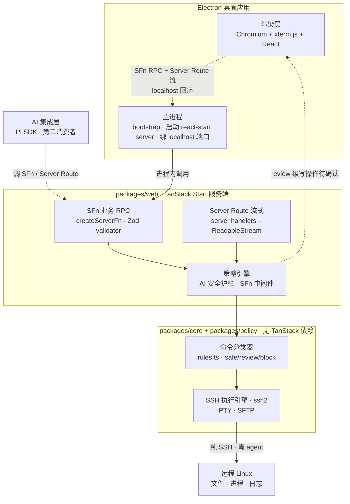

# SSH 可视化终端管理工具 · 技术架构

本文档定义项目的分层架构、技术栈选型、API 边界与 AI 安全策略引擎，可直接用于搭建脚手架。

## 1 技术栈选型

复用 fsdx 项目已验证的 TanStack Start 分层模式，叠加 SSH 场景专用库。全部 TypeScript v7，pnpm workspace。

| 层级 | 技术 | 选型理由 |
| --- | --- | --- |
| 运行时 | Node.js（Electron 内置） | Electron 主进程内启动 web 构建产物（Nitro server entry，`/api/health` 自检后加载窗口）；`node:sqlite` 依赖 Node 22.5+（Electron 43 内置 Node 24.17） |
| 语言 | TypeScript v7（原生编译器 tsgo） | 全仓类型安全；v7 原生编译器编译提速，大规模 workspace 友好 |
| 桌面外壳 | Electron | 自带 Chromium，三平台渲染一致；终端渲染（xterm.js）+ 中文输入稳定性碾压系统 WebView |
| 全栈框架 | TanStack Start（`@tanstack/react-start`） | 文件路由 + SFn RPC + Server Route 流式，fsdx 同款 |
| 通信范式 | SFn + Server Route | 业务 RPC 走 `createServerFn`，流式/下载/health 走 Server Route `server.handlers`；零 Hono、零 WebSocket（决策记录 D2） |
| UI | Tailwind CSS v4 + shadcn/ui | v4 CSS-first 零配置 + Radix 基础组件；主题走 CSS 变量 token，明暗双值（`:root` / `.dark`）+ class 切换，预留多主题（D13） |
| 表单 | `@tanstack/react-form` | 连接表单 / WebDAV 设置，与 Zod schema 复用、类型安全 |
| 表格 | `@tanstack/react-table` | 文件列表 / 审计日志 / 连接历史，headless 可控，排序与多选内置 |
| 日期 | dayjs | 轻量（2KB），Moment 兼容 API，格式化时间戳与日志时间 |
| 电子表格 | hucre | 零依赖读写 XLSX/CSV/ODS；连接清单、审计日志导出 Excel |
| 国际化 | i18next | 开源项目多语言基础，默认 zh-CN，UI 文案集中管理（D14） |
| 参数校验 | Zod | 每个 SFn 用 `.validator(z)` 做入参校验，类型安全；fsdx 同款 |
| SSH 协议 | ssh2 | 纯 Node.js SSH2 客户端，Tabby 同款，维护活跃，支持 PTY + SFTP |
| 终端渲染 | `@xterm/xterm`（xterm.js v6 新包名）+ 官方 addon | `@xterm/addon-webgl` / `fit` / `search` / `web-links` / `unicode11` / `image`；不用 `addon-attach`（依赖 WebSocket） |
| 日志 | Pino (createLogger 工厂) | 高性能结构化日志；fsdx 同款工厂注入模式 |
| 代码质量 | Biome（lint + format） | 单一工具替代 ESLint + Prettier，原生 TS 支持、速度极快；CI 校验 lint + format |
| 数据库 | `node:sqlite` + drizzle-orm | Node 22.5+ 内置驱动，零原生依赖；对齐 fsdx 的 db-sqlite skill |
| AI 引擎 | `@earendil-works/pi-coding-agent` (SDK 模式) | 开源 agent harness，可编程导出（types + import），15+ provider 已集成 |
| Monorepo | pnpm workspace | fsdx 同款；packages/core + packages/policy + packages/web + packages/desktop |
| 服务端数据缓存 | TanStack Query | 管理 SFn 拉取的连接/分组/设置等数据，queryKey 映射 SFn + 入参，失效策略覆盖增删改 |
| 客户端 UI 状态 | Zustand | 管理桌面窗口状态（Tab 列表、窗口、焦点、主题偏好），轻量且 selector 按需订阅 |
| 包边界保护 | vite import-protection | tanstackStart 内置 `importProtection` 选项，按 npm 包名拦截 ssh2 等进 renderer bundle；fsdx 同款机制 |

### 1.1 为什么 Electron 而非 Tauri

终端是 WebView 最吃力的工作负载——xterm.js 每秒成百上千次 DOM/GPU 合成、窗口 resize 是家常便饭。Tauri 依赖系统 WebView，在 Linux WebKitGTK + NVIDIA 会空白窗口/崩溃，Windows WebView2 的 CJK 输入法首次聚焦会冻结，高并发流式输出会触发 TCP 重置。Electron 自带 Chromium 彻底规避这些问题。代价是包体大（100MB+）、内存占用高，但桌面工具换"终端渲染 + 中文输入 + Linux 图形"四项稳，是划算的。

### 1.2 为什么嵌入 Pi SDK 而非自研 AI 层

Pi 是 earendil-works 的开源 agent harness，设计哲学"最小 harness + 可插拔扩展"与本项目的开源定位完全吻合。它已集成 15+ LLM provider，且以 SDK 模式导出（`exports['.']` 提供 types + import）。自研这些每一个都是月级别工程。Pi 的 session 树结构（可分支、可导出 HTML）还能白送 AI 操作审计日志。

## 2 系统架构

四层分离：桌面外壳 → TanStack Start 服务端（含策略中间件）→ SSH 执行引擎 → 远程 Linux。AI 作为网关的第二消费者接入。



图中最关键的不对称是：**读路径直通，写路径过策略引擎**。渲染层的写操作和 AI 的写操作走同一条路由、过同一道护栏——这样 AI 的能力是顺着现有架构长出来的，而不是后期硬接。虚线"写操作待确认"回流到渲染层，是人确认后才放行的安全闭环。

### 2.1 分层原则

沿用 fsdx 的三层代码分离，平移到 SSH 场景：

| 文件 | 职责 | 规则 |
| --- | --- | --- |
| `*.server.ts` | 纯 SSH 逻辑（连接、PTY、SFTP 操作） | 禁止使用 SFn 后缀；可被 `.functions.ts` 和其他 `.server.ts` 引用；路由/组件禁止直接 import |
| `*.functions.ts` | SFn 包装器 + Server Route 流式构造 | 每个 `createServerFn` 变量必须以 `SFn` 结尾；不直接操作 SSH |
| `*.schemas.ts` | Zod schema 定义 | 入参出参类型契约，服务层用 `z.infer` 派生类型 |

> **Server Route 例外**：文件下载/流式/health 等 API 路由（`routes/api/*.tsx`）允许通过 `server.handlers` 直接写服务端 handler 并引用 `.server.ts`——这是 TanStack Start Server Route 的合法形态，与 SFn 是两套并存范式，不适用"SFn 必须放 `.functions.ts`"规则（对齐 fsdx AGENTS.md）。

## 3 Monorepo 目录结构

TanStack Start 基于文件路由和约定式目录，框架对 `src/` 下的路径有强制要求。Monorepo 中 TanStack Start 应用包必须遵循这些约定，SSH 核心逻辑则独立为无框架依赖的 package。

> **框架约定路径（不可更改）**
> - `src/routes/` — 文件路由目录，`__root.tsx` 必须在此
> - `src/router.tsx` — Router 实例配置
> - `src/routeTree.gen.ts` — 自动生成，勿手动编辑
> - `app.config.ts` — TanStack Start + Vite 配置（包根目录）
> - `src/server.ts` — SSR 服务入口（可选，不提供则用默认）
> - `src/client.tsx` — 客户端水合入口（可选，不提供则用默认）

设计原则：**框架约定的归框架，业务逻辑归独立 package**。SFn 定义在 TanStack Start 应用包内（因为需要被 Vite 管线扫描），但 SSH / SFTP / PTY 核心逻辑抽到独立的 `packages/core` 中，保持框架无关和可测试性。

```text
// Monorepo 完整目录结构
ssh-os/
├── pnpm-workspace.yaml
├── package.json
├── tsconfig.json
├── packages/
│   ├── core/                     # 框架无关的 SSH 核心逻辑
│   │   ├── src/
│   │   │   ├── ssh-manager.ts    # SSH 连接管理 (ssh2)
│   │   │   ├── pty-manager.ts    # PTY 会话管理
│   │   │   ├── sftp-manager.ts   # SFTP 文件操作
│   │   │   ├── metrics-collector.ts  # 系统指标采集
│   │   │   ├── types.ts          # 共享类型定义
│   │   │   └── index.ts
│   │   └── package.json
│   │
│   ├── policy/                   # 命令分类引擎（框架无关）
│   │   ├── src/
│   │   │   ├── classifier.ts     # 命令分类器
│   │   │   ├── rules.ts          # 规则集（可热加载）
│   │   │   ├── types.ts          # Verdict / Rule 类型（safe/review/block）
│   │   │   └── index.ts
│   │   └── package.json
│   │
│   ├── desktop/                  # Electron 主进程
│   │   ├── src/
│   │   │   ├── main.ts           # Electron main: bootstrap + 启动 web server
│   │   │   ├── bootstrap.ts      # 启动初始化（DB 迁移/SSH 管理器 init/优雅关闭）
│   │   │   └── preload.ts        # preload: 注入全局变量
│   │   ├── electron-builder.yml
│   │   └── package.json
│   │
│   └── web/                      # TanStack Start 应用包
│       ├── app.config.ts        # ★ TanStack Start 配置
│       ├── vite.config.ts       # tanstackStart 插件 + importProtection + routeFileIgnorePattern
│       ├── package.json
│       ├── src/
│       │   ├── routes/           # ★ 框架约定：文件路由
│       │   │   ├── __root.tsx    # ★ 根路由：App Shell（侧栏 + Tab 栏）
│       │   │   ├── index.tsx     # 首页：空状态 / 最近连接
│       │   │   └── api/          # Server Route（流式/下载/health）
│       │   │       ├── health.tsx                       # GET /api/health
│       │   │       ├── pty.$sessionId.tsx               # GET 流：PTY 输出（ReadableStream）
│       │   │       ├── metrics.$sessionId.tsx           # GET 流：系统指标（ReadableStream）
│       │   │       ├── ai.chat.tsx                      # POST 流：AI 对话 SSE（动态 import 服务端）
│       │   │       ├── sftp/download.tsx                # GET 流：SFTP 文件下载
│       │   │       └── sftp/upload.tsx                  # POST 流：SFTP 文件上传
│       │   ├── router.tsx        # ★ 框架约定：Router 实例
│       │   ├── start.ts          # createStart：requestMiddleware 注册
│       │   ├── server.ts         # 框架约定：SSR 入口（Nitro server entry）
│       │   ├── client.tsx        # 框架约定：客户端水合（可选）
│       │   ├── routeTree.gen.ts  # ★ 自动生成，勿编辑
│       │   │
│       │   ├── app-framework/    # App 插件框架（manifest/context/生命周期分发）
│       │   │   ├── types.ts      # AppManifest / AppContext / AppDefinition / Lifecycle 类型
│       │   │   ├── registry.ts   # app 注册表 + surface 查询（window/panel/statusbar/autoStart）
│       │   │   ├── app-manager.ts    # 每 Tab 一个，驱动生命周期与布局快照（客户端，依赖注入）
│       │   │   ├── app-instances.ts  # 按连接维护 AppManager 单例（ensure / dispose）
│       │   │   └── dispatcher.ts     # onCreate/onRestore/onSave/onShutdown 分发
│       │   │
│       │   ├── apps/             # 桌面应用（核心，顶层目录，每个 app 一个插件包）
│       │   │   ├── index.ts          # registerBuiltinApps：内置 app 静态聚合注册
│       │   │   ├── terminal/
│       │   │   │   ├── app.ts                # manifest + setup(ctx)
│       │   │   │   ├── TerminalWindow.tsx    # 终端窗口（window surface）
│       │   │   │   ├── terminal.functions.ts # connect / createPty / sendInput / resizePty / closePty / disconnect SFn
│       │   │   │   └── terminal.schemas.ts
│       │   │   ├── files/
│       │   │   │   ├── app.ts                # manifest + setup(ctx)
│       │   │   │   ├── FileManager.tsx       # 文件管理窗口
│       │   │   │   ├── FileManagerMenu.tsx   # 右键菜单（内置项硬编码，贡献框架见 §6.6）
│       │   │   │   ├── files.functions.ts    # sftpList / sftpStat / sftpMkdir / sftpDelete / sftpRename SFn
│       │   │   │   └── files.schemas.ts
│       │   │   ├── monitor/
│       │   │   │   ├── app.ts                # manifest：window + panel 双 surface
│       │   │   │   ├── MonitorDashboard.tsx  # 系统监控窗口
│       │   │   │   └── MonitorPanel.tsx      # 桌面状态卡片（panel surface，自启）
│       │   │   ├── clock/
│       │   │   │   ├── app.ts                # statusbar surface · 自启
│       │   │   │   └── ClockStatusBar.tsx    # 任务栏时钟（statusbar surface）
│       │   │   └── ai/
│       │   │       ├── app.ts                # manifest + setup(ctx)
│       │   │       ├── AiPanel.tsx           # AI 面板窗口（手动消费 SSE）
│       │   │       ├── ai.functions.ts       # execCommandSFn（包装 exec.service）
│       │   │       ├── exec.service.ts       # execWithPolicy：分类 + 审计 + 审批登记
│       │   │       ├── ai.chat.server.ts     # AI 对话 SSE 服务端逻辑（Server Route 引用）
│       │   │       └── ai.schemas.ts
│       │   │
│       │   ├── components/       # 通用桌面组件
│       │   │   ├── Sidebar.tsx   # 侧栏连接管理
│       │   │   ├── Desktop.tsx   # 桌面容器（每个 Tab 一个）
│       │   │   ├── Taskbar.tsx   # 任务栏
│       │   │   └── Window.tsx    # 通用窗口组件（拖拽/聚焦/最小化）
│       │   │
│       │   ├── stores/           # Zustand 桌面 UI 状态（窗口/Tab/焦点）
│       │   │   └── windows.ts    # 窗口管理器 store
│       │   │
│       │   ├── middleware/       # SFn 中间件
│       │   │   ├── policy-engine.ts   # 策略引擎（safe/review/block）
│       │   │   ├── audit-log.ts       # 审计日志
│       │   │   └── prompt-guard.ts    # Prompt 注入检测（AI 对话入口共用）
│       │   │
│       │   ├── approval/         # 审批机制（Approval Registry）
│       │   │   ├── registry.ts   # 审批挂起表 + ApprovalRequiredError
│       │   │   └── approval.functions.ts  # approvalSFn 审批决策
│       │   │
│       │   ├── ai/               # Pi SDK 集成
│       │   │   └── pi-agent.ts  # Agent 封装 + 工具映射
│       │   │
│       │   ├── services/         # 领域服务层（对齐 fsdx）
│       │   │   ├── ssh/ssh.server.ts        # 连接生命周期（调 packages/core，断开时清审批挂起）
│       │   │   ├── sftp/sftp.server.ts      # SFTP 业务逻辑
│       │   │   ├── transfer/transfer.server.ts  # 统一流式响应构造（对齐 fsdx download.server）
│       │   │   ├── metrics/metrics.server.ts
│       │   │   └── settings/                # 连接 / 分组 / 设置 / 每连接配置
│       │   │       ├── settings.server.ts   # 数据库读写（凭据明文，D23）
│       │   │       ├── settings.functions.ts# SFn 包装（含 App 框架 settings / audit 网关）
│       │   │       └── settings.schemas.ts
│       │   │
│       │   ├── db/               # SQLite
│       │   │   ├── index.ts     # node:sqlite 连接 + drizzle
│       │   │   ├── schema.ts    # drizzle schema
│       │   │   ├── migrate.ts   # 程序化迁移（启动 fail-fast）
│       │   │   └── seed.ts      # 预置数据（默认分组 + Monokai 终端主题）
│       │   │
│       │   └── hooks/            # 自定义 React Hooks
│       │       └── use-metrics-stream.ts # 指标快照流消费（监控 / 状态卡片复用）
│       │                          # （PTY 流由 TerminalWindow 内联消费 ptyStreamSFn）
│       │
│       └── public/              # 静态资源
```

> **为什么 SFn 在 web 包而不是 core 包？**
> TanStack Start 通过 Vite 管线自动扫描 `createServerFn()` 调用并生成函数 ID（基于文件路径 + 函数名）。SFn 必须在 Vite 可扫描的 `src/` 目录下。`packages/core` 只包含纯逻辑（SSH 连接、PTY 管理、分类器），不依赖 TanStack Start，可独立测试和未来独立部署。

> **SFn 就近放置，不使用 fsdx 的 `-mods/` 目录**：本项目桌面应用在顶层 `src/apps/` 下、不在 `routes/` 内，无路由生成冲突，SFn 直接平级放在消费它的应用目录即可（`apps/terminal/terminal.functions.ts`），保留 `.functions.ts` 三层分离命名即可。

依赖关系：`packages/web` 依赖 `packages/core` 和 `packages/policy`；`packages/desktop` 依赖 `packages/web`（Electron main 启动 web 的构建产物或 dev server）。

### 3.1 vite.config.ts 关键配置

```typescript
// packages/web/vite.config.ts
import { tanstackStart } from "@tanstack/react-start/plugin/vite";
import { defineConfig } from "vite";

export default defineConfig({
  plugins: [
    tanstackStart({
      router: {
        // 防御性忽略非路由文件（apps/ 不在 routes/ 下，本无路由生成冲突）
        routeFileIgnorePattern: "\\.(functions|server|schemas)\\.ts$|__tests__",
      },
      importProtection: {
        client: {
          // 禁止 ssh2 等纯服务端依赖进入 renderer bundle
          specifiers: ["ssh2", "@earendil-works/pi-coding-agent"],
        },
      },
    }),
  ],
});
```

## 4 数据存储：SQLite

所有本地持久化数据统一使用 SQLite 存储，不引入 NeDB/JSON 文件等其他数据库。SQLite 嵌入式、零配置、单文件，与 Electron 桌面应用的定位完美匹配。

### 4.1 技术选型

| 维度 | SQLite（选定） | NeDB（electerm 方案） | JSON 文件 |
| --- | --- | --- | --- |
| 查询能力 | 完整 SQL，支持 JOIN/索引/事务 | 基础文档查询 | 无查询能力 |
| 数据量 | 轻松支撑百万行 | 万级文档后性能下降 | 不适合结构化数据 |
| 可靠性 | ACID 事务，WAL 模式 | 内存为主，定期落盘 | 写入冲突风险 |
| 生态 | node:sqlite 内置 / drizzle ORM | 已停止维护 | — |
| 迁移能力 | schema 版本管理，可 forward migrate | 无迁移机制 | 手动 |

### 4.2 库选择

Node.js v22.5+ 内置 node:sqlite 模块（`DatabaseSync`，零原生依赖），配合 drizzle-orm 做 schema 定义和类型安全查询（`drizzle-orm/node-sqlite` 适配器）。无需安装 better-sqlite3 等第三方 C++ 模块。Electron main 进程负责数据库读写，renderer 通过 SFn 访问。

> **关键陷阱（对齐 fsdx db-sqlite skill）**：node:sqlite 的**事务回调必须同步**（同 better-sqlite3）；普通查询经 drizzle 驱动返回 Promise，服务层统一 `await db.select()` 风格。

```typescript
// src/db/index.ts
import { DatabaseSync } from 'node:sqlite'
import { drizzle } from 'drizzle-orm/node-sqlite'
import * as schema from './schema'

// Node.js 内置 SQLite，零原生依赖。
// 注：drizzle-orm@1.0.0-rc.4 的 node-sqlite 配置 omit schema 字段（见决策记录技术验证记录），
// 查询以显式传表方式调用；schema 供 drizzle-kit 迁移使用
const sqlite = new DatabaseSync(
  path.join(app.getPath('userData'), 'ssh-os.db'),
  { enableForeignKeyConstraints: true }
)
sqlite.exec('PRAGMA journal_mode = WAL')  // 并发读不阻塞写
sqlite.exec('PRAGMA foreign_keys = ON')

export const db = drizzle({ client: sqlite })
```

### 4.3 Schema 设计

```typescript
// src/db/schema.ts
import { sqliteTable, text, integer } from 'drizzle-orm/sqlite-core'

// 连接分组
export const connectionGroup = sqliteTable('connection_group', {
  id: integer('id').primaryKey({ autoIncrement: true }),
  name: text('name').notNull(),
  color: text('color'),           // 装饰色，如 #6054F1
  sortOrder: integer('sort_order').default(0),
  createdAt: integer('created_at', { mode: 'timestamp' }).$defaultFn(() => new Date()),
})

// SSH 连接
export const connection = sqliteTable('connection', {
  id: integer('id').primaryKey({ autoIncrement: true }),
  groupId: integer('group_id').references(() => connectionGroup.id),
  title: text('title').notNull(),
  host: text('host').notNull(),
  port: integer('port').default(22),
  username: text('username').notNull(),
  authType: text('auth_type', {
    enum: ['password', 'privateKey', 'systemKey', 'agent'],
  }).notNull(),
  password: text('password'),    // 明文存储（D23）
  privateKey: text('private_key'),   // 手动粘贴的私钥，明文存储（D23）
  privateKeyPath: text('private_key_path'),   // 系统密钥路径，如 ~/.ssh/id_ed25519
  passphrase: text('passphrase'),      // 私钥密码，明文存储（D23）
  term: text('term').default('xterm-256color'),
  color: text('color'),                 // 标签装饰色
  terminalThemeId: integer('terminal_theme_id').references(() => terminalTheme.id),  // 每个连接独立终端主题
  isProduction: integer('is_production').default(0),  // 生产环境标记，影响 Policy Engine 规则集
  aiEnabled: integer('ai_enabled').default(1),        // AI 操作开关
  sortOrder: integer('sort_order').default(0),
  lastConnectedAt: integer('last_connected_at', { mode: 'timestamp' }),
  createdAt: integer('created_at', { mode: 'timestamp' }).$defaultFn(() => new Date()),
})

// 连接历史（每次连接插一行，含耗时；UI 按连接去重聚合展示）
export const connectionHistory = sqliteTable('connection_history', {
  id: integer('id').primaryKey({ autoIncrement: true }),
  connectionId: integer('connection_id').references(() => connection.id),
  host: text('host').notNull(),
  port: integer('port').default(22),
  username: text('username').notNull(),
  connectedAt: integer('connected_at', { mode: 'timestamp' }).notNull(),
  duration: integer('duration'),         // 秒
})

// 快速命令（预存常用命令，终端侧栏点击即执行）
export const quickCommand = sqliteTable('quick_command', {
  id: integer('id').primaryKey({ autoIncrement: true }),
  title: text('title').notNull(),
  command: text('command').notNull(),
  icon: text('icon'),
  sortOrder: integer('sort_order').default(0),
})

// 终端主题（ANSI 配色方案，每个连接独立引用）
export const terminalTheme = sqliteTable('terminal_theme', {
  id: integer('id').primaryKey({ autoIncrement: true }),
  name: text('name').notNull(),
  config: text('config').notNull(),     // JSON: ANSI 16色 + 前景/背景/光标
  isBuiltin: integer('is_builtin').default(0),
})

// 结构化日志（统一存储 AI 审计、终端命令、Policy Engine 决策等需查询的日志）
// classification 与 Policy Engine 三级命名统一：safe / review / block
export const log = sqliteTable('log', {
  id: integer('id').primaryKey({ autoIncrement: true }),
  type: text('type', { enum: ['ai_audit', 'terminal_command', 'policy_decision'] }).notNull(),
  sessionId: text('session_id'),
  connectionId: integer('connection_id').references(() => connection.id),
  command: text('command'),
  classification: text('classification', { enum: ['safe', 'review', 'block'] }),
  action: text('action', { enum: ['executed', 'blocked', 'pending_approval', 'approved', 'rejected', 'user_input'] }),
  result: text('result', { enum: ['success', 'failure', 'timeout'] }),   // 执行结果
  detail: text('detail'),               // JSON: 额外上下文
  timestamp: integer('timestamp', { mode: 'timestamp' }).notNull(),
})

// App 设置（键值对）
export const setting = sqliteTable('setting', {
  key: text('key').primaryKey(),
  value: text('value').notNull(),        // JSON 序列化
})

// 每连接配置（键值）：App 会话状态与桌面布局快照（key = app.<id>.state / desktop.layout），
// 未来每连接级扩展配置也走这里（如默认终端主题、快速命令作用域）
export const connectionSetting = sqliteTable('connection_setting', {
  connectionId: integer('connection_id').references(() => connection.id).notNull(),
  key: text('key').notNull(),
  value: text('value').notNull(),        // JSON 序列化
  updatedAt: integer('updated_at', { mode: 'timestamp' }).notNull(),
}, (t) => [
  uniqueIndex('connection_setting_uk').on(t.connectionId, t.key),
])
```

### 4.4 系统密钥与 SSH Agent

除了手动输入密码和粘贴私钥外，还支持直接使用系统中的 SSH 密钥和 SSH Agent 认证。借鉴 electerm 的 `ssh-config-loader` 方案，自动解析 `~/.ssh/config` 和扫描 `~/.ssh/` 目录。

| 认证方式 | authType 值 | 存储内容 | 连接时行为 |
| --- | --- | --- | --- |
| 密码 | `password` | `password`（明文存储，D23） | 直接用密码认证 |
| 手动私钥 | `privateKey` | `private_key`（明文存储，D23） | 用粘贴的私钥内容认证 |
| 系统密钥 | `systemKey` | `private_key_path`（如 `~/.ssh/id_ed25519`） | 实时读取系统密钥文件，不复制到数据库 |
| SSH Agent | `agent` | 无需存储密钥 | 通过 ssh-agent 转发认证（需用户已 ssh-add） |

> **SSH Agent 限制**：`agent` 认证读取 `SSH_AUTH_SOCK`。macOS 上从 Dock/Finder 启动的 Electron 进程**不继承 shell 环境**，该变量通常未设置——需在 `agent` 模式下兜底扫描常见 socket 路径（如 `/var/run/com.apple.socket.ssh-agent` 与 `$HOME/.gnupg/S.gpg-agent.ssh`），并在未找到时给出明确提示。

> **系统密钥扫描**：新建连接表单中选择 `systemKey` 时，自动扫描 `~/.ssh/` 目录下的密钥文件（id_rsa、id_ed25519、id_ecdsa 等），以下拉列表供用户选择。同时解析 `~/.ssh/config` 中的 Host 条目，支持直接引用 config 中定义的连接（包括 ProxyJump 跳板配置）。

```typescript
// src/ssh/keys.ts
import fs from 'node:fs'
import path from 'node:path'
import os from 'node:os'

const SSH_DIR = path.join(os.homedir(), '.ssh')

// 扫描系统密钥文件
export function scanSystemKeys(): string[] {
  const files = fs.readdirSync(SSH_DIR)
  return files.filter(f => {
    // 排除 .pub 公钥、config、known_hosts 等非密钥文件
    return !f.endsWith('.pub') &&
           !['config', 'known_hosts', 'authorized_keys', 'environment'].includes(f)
  }).map(f => path.join('~/.ssh', f))
}

// 解析 ~/.ssh/config
import { loadConfig } from 'ssh-config-loader'

export function loadSSHConfig() {
  const configPath = path.join(SSH_DIR, 'config')
  if (!fs.existsSync(configPath)) return []
  return loadConfig(configPath)  // 返回 [{ Host, HostName, User, Port, IdentityFile, ProxyJump, ... }]
}
```

```typescript
// src/ssh/connect.ts
import { connect } from 'ssh2'

export function createSSHConnection(opts: ConnectionOpts) {
  const config: ssh2.ConnectConfig = {
    host: opts.host,
    port: opts.port,
    username: opts.username,
  }

  switch (opts.authType) {
    case 'password':
      config.password = opts.password
      break
    case 'privateKey':
      config.privateKey = opts.privateKey
      if (opts.passphrase) {
        config.passphrase = opts.passphrase
      }
      break
    case 'systemKey':
      // 实时读取系统密钥文件，不落库
      const keyPath = opts.privateKeyPath.replace('~', os.homedir())
      config.privateKey = fs.readFileSync(keyPath, 'utf-8')
      if (opts.passphrase) {
        config.passphrase = opts.passphrase
      }
      break
    case 'agent':
      // 通过 SSH agent 认证，无需密钥文件
      config.agent = process.env.SSH_AUTH_SOCK
      break
  }

  return connect(config)
}
```

### 4.5 运行时文件日志（Pino）

调试和排查用的运行时日志不进 SQLite，使用 `pino` 写本地文件，按天轮转。记录 SSH 握手细节、SFTP 传输过程、异常堆栈、SFn 调用链等。日志文件存储在 `{userData}/logs/` 目录下。

```typescript
// src/logger.ts
import pino from 'pino'
import { app } from 'electron'
import path from 'node:path'

const logFile = path.join(app.getPath('userData'), 'logs', 'app.log')

export const logger = pino({
  level: process.env.NODE_ENV === 'development' ? 'debug' : 'info',
  transport: {
    target: 'pino/file',
    options: { destination: logFile, mkdir: true },
  },
})

// 使用示例
logger.info({ host, port }, 'SSH connecting')
logger.error({ err, sessionId }, 'SSH connection failed')
logger.debug({ channelId, bytes }, 'PTY data received')
```

| 层 | 存储 | 记录内容 | 用途 |
| --- | --- | --- | --- |
| 结构化日志 | SQLite `log` 表 | AI 审计、终端命令、Policy Engine 决策 | UI 展示、查询过滤、审计面板 |
| 运行时日志 | 本地文件（Pino） | SSH 握手、SFTP 传输、异常堆栈、SFn 调用 | 开发调试、问题排查 |

> 高频审计写入建议对齐 fsdx 的 BatchWriter 模式：定时/定量批量 INSERT + 容量上限 + 进程退出时强制刷新，避免每条命令都落库拖慢 PTY 吞吐。

### 4.6 凭据存储（明文，开发期）

密码、私钥、passphrase 与 AI provider API key 当前**明文存储**在 SQLite（决策记录 D23）：`connection` 表 `password` / `private_key` / `passphrase` 列、`setting` 表 `ai.credential.<provider>`。此前定案的 AES-256-GCM + 数据目录 `master.key` 加密（D21/D22）已整体移除——加密链路在开发期拖累调试（凭据以密文落库，直查 DB / 复现问题需先解密，且 dev-only 降级密钥与生产路径行为不一致）。

```sql
-- connection 表（D23 后）
password       TEXT  -- 明文
private_key    TEXT  -- 手动粘贴的私钥，明文
passphrase     TEXT  -- 私钥密码，明文
```

凭据写入在 `services/settings/settings.server.ts`（`createConnection` / `updateConnection` 直接落明文，编辑连接时空值不覆盖存量），连接时由 `services/ssh/ssh.server.ts` 直读组装 `ConnectionOptions`。`updateConnection` 保留「空值不更新」语义，避免编辑标题时清空密码。

> **安全权衡**：明文存储意味着 SQLite 文件泄露即凭据泄露。此为**开发期决策**，生产上线前须按用户明确要求重新引入加密方案（届时新建决策记录）。系统密钥（`systemKey`）始终实时读文件、不落库。

### 4.7 Schema 迁移

使用 Drizzle Kit 管理迁移。每次 schema 变更生成 SQL 迁移文件，应用启动时在 bootstrap 中自动执行 pending migrations（对齐 fsdx：程序化迁移，失败即启动失败，fail-fast）。

```bash
# 生成迁移
npx drizzle-kit generate

# 应用启动时自动 migrate（bootstrap 调 src/db/migrate.ts 的 runMigrations()）
```

### 4.8 数据存储位置

数据目录统一由 `getDataDir()`（`src/lib/paths.ts`）解析，`SSHOS_DATA_DIR` 环境变量可覆盖（测试注入 / 宿主定制）：

| 环境 | 数据目录 |
| --- | --- |
| 开发 | `~/.ssh-os-dev/` |
| 生产 | `~/.ssh-os/` |

数据库 `ssh-os.db` 与运行时日志 `logs/` 均落在该目录下。WAL 模式下同时存在 `ssh-os.db-wal` 和 `ssh-os.db-shm` 文件，属正常现象。

### 4.9 数据同步：WebDAV

支持将本地 SQLite 数据库文件通过 WebDAV 协议同步到用户自建的 WebDAV 服务器，实现多设备间连接书签、快速命令、终端主题等数据的同步。开源项目不引入云服务，用户完全掌控自己的数据。

> **范围**：个人云同步为**既定功能（MVP 后交付）**，同步载体只做 WebDAV 一种。

#### 同步策略

| 维度 | 设计 |
| --- | --- |
| 同步粒度 | 整库文件同步（ssh-os.db），不拆表增量 |
| 触发时机 | 手动同步 + 应用退出时自动同步 + 启动时检测远端更新 |
| 冲突处理 | 时间戳比较：远端更新时间 > 本地 → 拉取；本地更新时间 > 远端 → 推送；无法判断 → 弹窗让用户选择 |
| 敏感数据 | 密码/私钥为明文存储（D23），整库同步即同步凭据；同步目标应视为可信环境 |
| 同步范围 | 仅同步 ssh-os.db 主文件，WAL/SHM 文件不同步（推送前 checkpoint 合并） |

#### 同步流程

```text
推送（Push）：
  1. SQLite checkpoint → 将 WAL 合并到主 db 文件
  2. 记录本地 lastModified 时间戳
  3. PUT ssh-os.db 到 WebDAV 服务器
  4. 在远端写入元数据文件 ssh-os.db.meta（含时间戳、设备名）

拉取（Pull）：
  1. GET ssh-os.db.meta → 比较远端时间戳 vs 本地时间戳
  2. 若远端更新 → 先本地 checkpoint，把 WAL 合并到主 db 文件（避免本地未落盘数据在替换时丢失）
  3. GET ssh-os.db 到临时文件，校验 SQLite 完整性（PRAGMA integrity_check）
  4. **关闭当前主 DB 连接** → 替换本地 db 文件 → 重新打开连接（Windows 上替换被占用的文件会失败，必须按此顺序）

冲突解决：
  1. 比较本地 lastModified 和远端 meta 时间戳
  2. 本地更新 → 提示用户：推送覆盖远端 / 拉取覆盖本地 / 取消
  3. 用户选择后执行对应操作
```

#### WebDAV 配置

```typescript
// src/db/sync.ts
interface WebDAVConfig {
  url: string          // WebDAV 服务器地址，如 https://dav.example.com/ssh-os/
  username: string
  password: string  // 明文存储（D23）
  autoSync: boolean    // 退出时自动推送
  deviceId: string     // 设备标识，用于冲突提示
}

// 使用 webdav npm 包
import { createClient } from 'webdav'

export async function pushToWebDAV(config: WebDAVConfig, dbPath: string) {
  const client = createClient(config.url, {
    username: config.username,
    password: config.password,
  })
  // checkpoint 合并 WAL
  const db = new DatabaseSync(dbPath)
  db.exec('PRAGMA wal_checkpoint(TRUNCATE)')
  db.close()
  // 上传
  const buffer = await fs.readFile(dbPath)
  await client.putFileContents('ssh-os.db', buffer)
  // 写元数据
  const meta = JSON.stringify({
    lastModified: Date.now(),
    deviceId: config.deviceId,
  })
  await client.putFileContents('ssh-os.db.meta', meta)
}

export async function pullFromWebDAV(config: WebDAVConfig, dbPath: string) {
  const client = createClient(config.url, {
    username: config.username,
    password: config.password,
  })
  // 下载到临时文件
  const tmpPath = dbPath + '.tmp'
  const buffer = await client.getFileContents('ssh-os.db')
  await fs.writeFile(tmpPath, buffer)
  // 完整性校验
  const db = new DatabaseSync(tmpPath, { readOnly: true })
  const result = db.prepare('PRAGMA integrity_check').get()
  db.close()
  if (result.integrity_check !== 'ok') {
    throw new Error('下载的数据库文件完整性校验失败')
  }
  // 替换本地文件前：必须已关闭应用主 DB 连接（Windows 上重命名被占用的文件会失败），
  // 且此前已做本地 checkpoint 合并 WAL，避免远端主文件覆盖掉本地未落盘数据
  await fs.rename(tmpPath, dbPath)
}
```

> **为何选 WebDAV**：WebDAV 是标准 HTTP 协议扩展，坚果云、Nextcloud、Synology 等均原生支持，用户无需额外部署服务端。开源项目不依赖任何商业云，用户数据完全自主可控。相比 electerm 的 5 种同步方式（Gist/WebDAV/自定义服务器/云），只做 WebDAV 一种即可覆盖绝大多数个人多设备场景。

#### 设置界面

在设置面板中提供 WebDAV 配置表单：服务器地址、用户名、密码、自动同步开关、设备名。配置完成后显示「测试连接」按钮，验证 WebDAV 可达性和读写权限。同步状态在底部状态栏显示图标：已同步 / 同步中 / 同步失败 / 远端有更新。

### 4.10 状态管理

状态按作用域分四层管理，职责互不重叠：

**服务端会话状态（packages/core，内存态）**

SSH / PTY / SFTP 会话由 `ssh-manager`、`pty-manager`、`sftp-manager` 以 `sessionId` 为 key 的内存 Map 维护，供 SFn handler 跨调用共享。生命周期绑定 Tab：连接断开即清理对应会话，进程退出统一释放。会话数据是临时的，**不持久化**，仅连接配置落 SQLite。

**客户端数据缓存（服务端数据）**

连接列表、分组、设置等来自 SQLite 的数据，由 TanStack Query 统一管理。`queryKey` 映射到 SFn + 入参，通过 `useQuery` 消费 SFn 获取；连接增删改、WebDAV 同步完成后主动 `invalidateQueries` 失效刷新，避免各窗口各自维护一份重复状态。

**客户端 UI 状态（Zustand，桌面全局态）**

桌面窗口状态是纯客户端全局态，由 Zustand store 管理：Tab 列表、窗口管理器（z-index / position / size / minimized / maximized）、聚焦窗口、主题偏好（light/dark，运行时走 store，持久化到 `setting` 表 key = `appearance.theme`）。store 只存 UI 状态，不存远程数据。**流式数据（PTY 输出、监控指标、AI 对话）不进全局 store**——高频更新会触发整树重渲染，由组件内局部 hook（`use-metrics-stream`、TerminalWindow / AiPanel 内联流消费）直接消费。

**App 实例状态（App 插件框架，每连接持久化）**

App 的会话状态（哪些 app 打开、各 surface 槽位、窗口布局、app 自身保存的状态）由 `app-manager` 统一管理，读写 `connection_setting`（key = `desktop.layout` / `app.<id>.state`）。运行期 UI 状态仍走 Zustand，App 框架只负责生命周期的保存/恢复分发（详见 §6）。

```typescript
// packages/web/src/stores/windows.ts —— 桌面窗口 store 示例
import { create } from 'zustand'

interface WindowState {
  windows: Record<string, { zIndex: number; x: number; y: number; w: number; h: number; minimized: boolean }>
  focused: string | null
  focus: (id: string) => void
  minimize: (id: string) => void
}

export const useWindowStore = create<WindowState>((set) => ({
  windows: {},
  focused: null,
  focus: (id) => set((s) => ({
    focused: id,
    windows: { ...s.windows, [id]: { ...s.windows[id], zIndex: ++maxZIndex } },
  })),
  minimize: (id) => set((s) => ({
    windows: { ...s.windows, [id]: { ...s.windows[id], minimized: true } },
  })),
}))
```

## 5 通信：SFn RPC + Server Route 流式

客户端与服务端通信统一由 TanStack Start 承载，分两种形态：

- **SFn（Server Functions）**：业务 RPC，`createServerFn()` + `.validator(z)` + `.middleware()`，端到端类型安全
- **Server Route（`server.handlers`）**：流式/下载/health，`createFileRoute(...)` 内直接写服务端 handler 返回 `Response`

核心设计原则：

- **零 WebSocket**：PTY 流、文件传输、监控指标、AI 对话全部走 Server Route 的 HTTP 流式响应，不使用 `addon-attach` 等 WebSocket 方案
- **中间件即网关**：Policy Engine、审计日志等横切逻辑实现为 SFn middleware，一次定义全局复用
- **渲染进程零直接 IPC**：Renderer 永远通过 SFn / Server Route 调用 Main，不使用 Electron `ipcMain` / `ipcRenderer`
- **未来 CS 零成本**：所有通信已是 HTTP-based，从 Electron localhost 切换到远程 Node 服务只需改 base URL

> **流式实现说明**：TanStack Start 的 `createServerFn` 返回值经 `startSerializer` 序列化，早期版本无法序列化 async generator / 裸 ReadableStream；**D21 后版本已支持**（handler 返回 `ReadableStream` / async generator，客户端逐块 / `for await` 消费，见决策记录技术验证记录「SFn 流式返回实测」）。流式接口两种范式并存：需要原生 `Response` 透传（下载 / 二进制 / SSE 逐帧语义）时用 Server Route；业务流式（AI 对话增量、PTY 输出、指标快照）可用 SFn，享受统一鉴权与类型安全。

### 5.1 通信模式总览

| 通信模式 | 承载形态 | 代码模式 |
| --- | --- | --- |
| PTY 输出流 | SFn GET（流式） | handler 返回 `ReadableStream`，客户端逐块解码 |
| PTY 键盘输入 | SFn POST + Zod | `.inputValidator(z).handler(pty.write)` |
| SFTP 文件操作 | SFn POST/GET + Zod | `.inputValidator(schema).handler(sftp)` |
| 文件下载 | Server Route GET | `createFileDownloadResponse(stream, {...})` |
| 系统监控指标 | SFn GET（流式） | handler 返回 `ReadableStream`，每 2s 一个 chunk |
| AI 对话流 | SFn POST（流式） | handler 返回 `ReadableStream<AiStreamChunk>`，面板逐块消费 |
| 连接管理 | SFn POST + Zod | `.inputValidator(z).handler(sshManager.connect)` |
| 健康检查 | Server Route GET | `routes/api/health.tsx` 返回 JSON |

### 5.2 流式实现：SFn ReadableStream（D21）

**PTY 输出流** — 服务端把 PTY 的 Node Readable 转为 Web ReadableStream 作为 SFn handler 返回值；客户端调用 SFn 后对返回流逐块解码。适用于 PTY 输出、监控指标、AI 对话增量等持续下行流（统一鉴权 + 类型安全）。

```typescript
// packages/web/src/apps/terminal/terminal.functions.ts
export const ptyStreamSFn = createServerFn({ method: 'GET' })
  .validator(ptyStreamSchema)
  .handler(async ({ data }) => {
    const { Readable } = await import('node:stream')
    const pty = ptyManager.getBySession(data.sessionId)
    if (!pty) throw new Error('PTY 会话不存在')
    return Readable.toWeb(pty.output) as ReadableStream
  })
```

```typescript
// 客户端消费（TerminalWindow.tsx）
const stream = await ptyStreamSFn({ data: { sessionId } })
const reader = stream.getReader()
const decoder = new TextDecoder()
while (true) {
  const { done, value } = await reader.read()
  if (done) break
  term.write(decoder.decode(value, { stream: true }))
}
```

**文件下载流** — 统一走 `services/transfer/transfer.server.ts` 的 `createFileDownloadResponse`（对齐 fsdx）：将 Buffer / Node Readable 统一转 Web ReadableStream，Content-Disposition 同时输出 RFC 6266 `filename` 回退值与 RFC 5987 `filename*`，避免中文文件名乱码。

```typescript
// packages/web/src/services/transfer/transfer.server.ts
export function createFileDownloadResponse(
  source: Buffer | string | Readable,
  opts: { filename: string; mimeType?: string },
): Response {
  return new Response(Readable.toWeb(
    source instanceof Readable ? source : Readable.from(source),
  ) as ReadableStream, {
    headers: {
      'Content-Type': opts.mimeType ?? 'application/octet-stream',
      'Content-Disposition': `attachment; filename="${toFallbackFilename(opts.filename)}"; filename*=UTF-8''${encodeRfc5987(opts.filename)}`,
    },
  })
}
```

```typescript
// packages/web/src/routes/api/sftp/download.tsx —— 流式下载（路由文件须用子目录组织，点号不为路径分隔符，见决策记录技术验证记录）
export const Route = createFileRoute('/api/sftp/download')({
  server: {
    handlers: {
      GET: async ({ request }) => {
        const { sessionId, path } = Object.fromEntries(new URL(request.url).searchParams)
        const stream = await sftpManager.createReadStream(sessionId, path)
        return createFileDownloadResponse(stream, { filename: basename(path) })
      },
    },
  },
})
```

**AI 对话流** — 走 `aiChatSFn`（SFn 流式，handler 返回 `ReadableStream<AiStreamChunk>`，服务端依赖在 handler 内动态 import），客户端 `AiPanel` 调用后逐块读取 `text-delta` 增量。`@tanstack/ai-react` 的 `useChat` 未采用（依赖保留），详见决策记录技术验证记录「SFn 流式返回实测」与 §8。

**健康检查** — `/api/health` 用 Server Route 一行实现，供 Electron main 启动后自检：

```typescript
// packages/web/src/routes/api/health.tsx
export const Route = createFileRoute('/api/health')({
  server: {
    handlers: {
      GET: () => new Response(JSON.stringify({ status: 'ok' }), {
        headers: { 'Content-Type': 'application/json' },
      }),
    },
  },
})
```

### 5.3 双向终端通信：Server Route 下行 + SFn 上行

终端是唯一的双向通信场景。用两条通道解决：一条 `ptyStreamSFn`（SFn 流式）推送 PTY 输出，一条 SFn POST 发送键盘输入。

> **策略边界**：`sendInputSFn` **不挂 Policy Engine**。终端输入是逐键分段流，`rm -rf /` 会先以 `r`、`rm`、`rm ` 等形式经过，命令未完成时无法可靠分类，且输入最终在远程 shell 执行，本地无法识别"一条完整命令"。命令级策略由 `execCommandSFn`（命令级、非交互）统一承载；文件管理器的变更写操作（删除 / 重命名 / 移动）由对应 SFn 挂策略（见 §7），创建（mkdir / 上传）为低风险新建直接放行。用户在终端手动敲命令属直接操作，不做本地拦截。

| 方向 | 形态 | 说明 |
| --- | --- | --- |
| Server → Client | Server Route GET + ReadableStream | PTY 输出持续推送 |
| Client → Server | SFn POST + `.inputValidator(z)` | 键盘输入，仅做 UTF-8 等格式校验 |

```typescript
// 客户端发送按键输入
export const sendInputSFn = createServerFn({ method: 'POST' })
  .inputValidator(z.object({
    sessionId: z.string(),
    data: z.string(),
  }))
  .handler(async ({ data }) => {
    ptyManager.get(data.sessionId).write(data.data)
    return { ok: true }
  })
```

### 5.4 SFn 函数清单

SFn 就近定义在消费它的应用组件目录下（`apps/<app>/<app>.functions.ts`，平级放置），变量名统一 `SFn` 后缀；连接 / 分组 / 设置等全局数据统一在 `services/settings/settings.functions.ts`：

| SFn | HTTP 方法 | 说明 | 位置 |
| --- | --- | --- | --- |
| `listConnectionsSFn` | GET | 列出全部已保存连接（不含凭据字段） | `services/settings/` |
| `listGroupsSFn` | GET | 列出全部分组 | 同上 |
| `createConnectionSFn` | POST | 新建连接（凭据明文入库，D23） | 同上 |
| `updateConnectionSFn` | POST | 更新连接（未提供的敏感字段保持原值） | 同上 |
| `deleteConnectionSFn` | POST | 删除连接（先清子表再删主表） | 同上 |
| `testConnectionSFn` | POST | 测试连接（5s 超时，返回 OS 信息） | 同上 |
| `getConnectionSettingSFn` | GET | 读每连接配置（App 框架 settings 网关，key = `app.<id>.state` / `desktop.layout`） | 同上 |
| `setConnectionSettingSFn` | POST | 写每连接配置（upsert） | 同上 |
| `recordAuditSFn` | POST | App 框架审计记录（`ctx.audit.record` 的服务端落库通道） | 同上 |
| `connectSFn` | POST | 建立 SSH 连接，返回 sessionId | `apps/terminal/` |
| `disconnectSFn` | POST | 断开指定 SSH 连接（同步清空该会话审批挂起项） | 同上 |
| `createPtySFn` | POST | 创建 PTY 会话（每个终端窗口一个 channel） | 同上 |
| `sendInputSFn` | POST | 向 PTY 写入键盘输入（逐键流，不挂策略） | 同上 |
| `resizePtySFn` | POST | 调整终端尺寸 | 同上 |
| `closePtySFn` | POST | 关闭 PTY 会话（终端窗口卸载时销毁，避免重开复用死 pty） | 同上 |
| `execCommandSFn` | POST | 非交互命令执行（内部走 `exec.service` 的 `execWithPolicy`，挂策略，见 §7.7） | `apps/ai/` |
| `approvalSFn` | POST | review 级命令审批决策（approved / rejected，重放原请求） | `approval/` |
| `listPendingApprovalsSFn` | GET | 列出某会话挂起审批（渲染层审批弹窗消费） | 同上 |
| `sftpListSFn` | GET | 列出远程目录 | `apps/files/` |
| `sftpStatSFn` | GET | 获取文件元信息 | 同上 |
| `sftpMkdirSFn` | POST | 创建远程目录（低风险新建，不挂策略） | 同上 |
| `sftpDeleteSFn` | POST | 删除远程文件 / 目录（挂审计 + 策略路径分类） | 同上 |
| `sftpRenameSFn` | POST | 重命名 / 移动（挂审计 + 策略路径分类，SFTP rename 原语覆盖两者） | 同上 |

> AI 对话走 SFn 流式：`aiChatSFn` 返回 `ReadableStream<AiStreamChunk>`（见 §5.5 / §8），`@tanstack/ai-react` 的 `useChat` 未采用，AiPanel 逐块消费增量（决策记录技术验证记录）。

### 5.5 Server Route 清单

| Route | 方法 | 说明 |
| --- | --- | --- |
| `api/health.tsx` | GET | 健康检查 |
| `terminal.functions` ptyStreamSFn | SFn GET (stream) | PTY 输出流（ReadableStream） |
| `metrics.functions` metricsStreamSFn | SFn GET (stream) | 系统指标流（每 2s 一个 chunk） |
| `api/sftp/download.tsx` | Server Route GET (stream) | SFTP 文件下载（ReadableStream，RFC 6266/5987 文件名） |
| `api/sftp/upload.tsx` | Server Route POST (stream) | SFTP 文件上传（body 直写远程路径） |
| `ai.functions` aiChatSFn | SFn POST (stream) | AI 对话流（ReadableStream<AiStreamChunk>，text-delta 增量） |

### 5.6 终端增强功能实现载体

界面设计 §5 中部分终端增强功能需要明确实现载体，避免悬空设计：

| 功能 | 实现载体 | MVP |
| --- | --- | --- |
| 终端搜索（Cmd/Ctrl+F） | `@xterm/addon-search` | 含 |
| OSC52 剪贴板 | `@xterm/addon-clipboard`（官方）+ preload 写本地剪贴板 | 含 |
| 终端图片（iTerm2 协议） | `@xterm/addon-image`，WebGL 渲染下兼容性待 W0 验证 | 待定 |
| SFTP 路径跟随（cd 联动） | shell 集成：注入 `PROMPT_COMMAND` 钩子，cd 后 exec `pwd` 回传，联动文件管理窗口 | 后续迭代 |
| AI 当前路径获取 | 同上 `pwd` 查询通道，AI 面板读取终端当前目录 | 后续迭代 |
| 命令提示（历史补全） | shell 集成注入，依赖远程 shell history，风险高 | 后续迭代 |
| 批量输入广播 | `sendInputSFn` 扩展支持 `sessionIds: string[]`，同一桌面多终端批量写入 | 后续迭代 |
| Zmodem / trzsz 传输 | `trzsz` npm 包（rz/sz），待 W0 确认；MVP 以拖拽上传（SFTP）为主 | 待定 |

> **结论**：MVP 终端能力以「xterm.js 官方 addon + 拖拽/粘贴传输」为边界；shell 集成、批量输入、Zmodem 等强远程依赖能力统一标注后续迭代，不阻塞 W1-W4 交付。

## 6 App 插件框架

桌面上的应用本质是**插件**：每个 app 是一个独立插件包，通过 manifest 声明自身形态与能力，启动时获得 App Context 和一组生命周期钩子。框架借鉴 VS Code 扩展（声明式 manifest + 贡献点）、Android Activity（实例终止 + SavedState 恢复）、KDE Plasmoid（同一控件多放置形态）的设计。全部为客户端架构，不改变通信范式（仍走 SFn / Server Route）。

### 6.1 Manifest：形态、能力、放置

```typescript
// packages/web/src/app-framework/types.ts
type Capability = 'pty' | 'sftp' | 'exec' | 'ai' | 'metrics'
type PanelSlot = 'top-left' | 'top-right'        // 桌面面板槽位
type StatusBarSlot = 'left' | 'center' | 'right' // 状态栏槽位
type ContextMenuTarget = 'file' | 'folder'       // 右键菜单作用对象（MVP：远程文件/文件夹）

// 右键菜单贡献项（声明式，见 §6.6）：结构与 VS Code contributes.contextMenus 对齐
interface ContextMenuContribution {
  id: string                  // 唯一标识，处理器据此绑定（如 'myapp.openWith'）
  target: ContextMenuTarget   // 作用于文件还是文件夹
  label: string               // 显示文案（i18n key 或字面量）
  icon?: string
  group: string               // 分组：'open' | 'manage' | 'transfer' | 'custom'
  order?: number              // 组内排序（默认 0）
  when?: string               // 条件表达式（简化）：folder-only / selection-count / 路径 glob
}

interface AppManifest {
  id: string
  title: string
  icon?: string
  capabilities: Capability[]     // 能力声明，框架据此裁剪 ctx.ssh 暴露面
  singleton?: boolean            // window 是否单实例（默认 false，可多开）
  surfaces: Array<
    | { kind: 'window'; defaultSize?: { w: number; h: number } }
    | { kind: 'panel'; slot: PanelSlot; autoStart?: boolean }
    | { kind: 'statusbar'; slot: StatusBarSlot; autoStart?: boolean }
  >
  remoteRequirements?: RemoteToolRequirement[]  // 远程工具依赖（§6.7 发行版适配）
  contributes?: {
    contextMenus?: ContextMenuContribution[]   // 右键菜单贡献点（文件/文件夹）
  }
}

// 远程工具依赖（§6.7 发行版适配，决策记录 D20）
interface RemoteToolRequirement {
  id: string                    // 工具标识，默认探测目标（command -v <id>）
  label: string                 // 展示名（i18n key 或字面量）
  neededFor: string[]           // 依赖此工具的功能 id
  fallback?: string             // 无此工具时的降级行为说明（UI hint）
  optional?: boolean            // true=仅增强（缺失仅降级/隐藏）；false=核心依赖（缺失触发安装引导）
}
```

**三种 surface（放置形态）**：

| surface | 放置 | 桌面图标 | 打开方式 | 例子 |
| --- | --- | --- | --- | --- |
| `window` | 桌面窗口 | 有 | 手动双击图标 / 任务栏 | terminal、files、monitor、ai |
| `panel` | 桌面面板槽位（如右上角） | 无 | 自启或手动启用 | 系统状态卡片（monitor 的 panel） |
| `statusbar` | 底部状态栏槽位 | 无 | 自启 | 时钟、连接状态 |

一个 app 可同时贡献多种 surface（KDE 模式）：monitor 同时提供 `window`（完整监控仪表盘，手动打开）与 `panel`（桌面状态卡片，自启），共用同一份能力与逻辑。

### 6.2 App Context

启动时框架把 App Context 注入给 app，app 只能访问 manifest 声明的能力：

```typescript
interface AppContext {
  session: { connectionId: number; sessionId: string }   // 所属 SSH 会话
  ssh: SshGateway            // exec / sftp / pty，按 capabilities 裁剪
  policy: PolicyApi          // 命令分类、审批请求
  audit: AuditApi
  settings: SettingsApi      // 每连接键值 connection_setting
  ui: UiApi                  // openWindow / 面板写入 / 状态栏写入 / 实例管理
  menus: ContextMenuApi      // 右键菜单贡献：registerHandler(id, handler)（§6.6）
  lifecycle: LifecycleApi    // 注册 onSave / onRestore / onShutdown
  log: Logger
}
```

### 6.3 生命周期（四个钩子）

实例终止但状态保留——Tab 关闭不等于数据丢失，下次进入由系统自动还原：

```text
registered
  → 连接成功 / statusbar 自启 → onCreate(ctx)
  → 有保存状态 → onRestore(state)          # 还原上次
  → running
  → Tab 关闭 → onSave() 收状态 → onStop()   # 实例销毁、状态保留
  → Tab 重建 → onCreate → onRestore(上次状态)
  → 系统退出 → onShutdown('systemExit' | 'tabClose' | 'userClose')
```

- `onCreate(ctx)`：初始化，返回 Disposable（对齐 VS Code 订阅模式，dispose 时清理）
- `onRestore(state)`：有上次保存状态时调用，还原布局与内容
- `onSave()`：Tab 关闭 / 系统退出前调用，返回可序列化 JSON 状态
- `onShutdown(reason)`：实例被系统关闭时调用，`reason` 区分是系统退出、Tab 关闭还是用户手动关闭

```typescript
// apps/clock/app.ts —— statusbar app 示例（自启、无图标、常驻）
export const manifest: AppManifest = {
  id: 'clock',
  title: '时钟',
  capabilities: [],
  singleton: true,
  surfaces: [{ kind: 'statusbar', slot: 'right', autoStart: true }],
}

export function setup(ctx: AppContext) {
  const timer = setInterval(() => ctx.ui.writeStatusbar('clock', fmtTime()), 1000)
  return { dispose: () => clearInterval(timer) }
}
```

### 6.4 AppManager 与状态存储

- `app-manager`：每 Tab（连接）一个实例，负责生命周期分发与布局快照读写；渲染期窗口状态仍走 Zustand store。**纯客户端实现**——settings / audit / log 经构造注入（SFn 网关），不直连服务端模块；`app-instances.ts` 按连接维护单例（连接就绪后 `ensureAppManager` 创建并自启 autoStart app，Tab 关闭 `disposeAppManager` 回收）
- **渲染层驱动**：桌面图标、面板槽位、任务栏 statusbar 槽位均由 registry 的 surface 查询（`listWindowApps` / `listPanelApps` / `listStatusbarApps`）驱动，窗口内容按 app id 分发（`Desktop.tsx` 的 `WINDOW_CONTENT` 映射）；`AppManager` 只负责实例生命周期与状态持久化，二者解耦
- **布局快照**（哪些 app 打开、各 surface 槽位、window bounds）→ `connection_setting` key = `desktop.layout`
- **app 会话状态**（`onSave()` 产物）→ `connection_setting` key = `app.<id>.state`（经 `getConnectionSettingSFn` / `setConnectionSettingSFn`）
- **app 偏好配置**（如时钟格式，跨连接）→ 全局 `setting` key = `app.<id>.*`
- 系统退出时在优雅关闭阶段 flush 全部 `onSave()` 与审计缓冲（web server 收到 SIGTERM/SIGINT 时 `batchWriter.flushOnExit()`，对齐 §7.8）

### 6.5 内置 app 清单

| app | surfaces | capabilities | 说明 |
| --- | --- | --- | --- |
| terminal | window（可多开） | pty / sftp | 终端窗口，多实例独立 PTY（拖拽上传经 SFTP 通道，见 §5.7） |
| files | window | sftp | 文件管理窗口（内置右键菜单项经贡献点注册，见 §6.6） |
| monitor | window + panel（自启） | metrics | 完整监控窗口 + 桌面状态卡片 |
| clock | statusbar（自启） | — | 时钟，常驻状态栏 |
| ai | window | exec / ai | AI 面板窗口 |

### 6.6 上下文菜单（Context Menu 贡献点）

App 插件可为**远程文件 / 文件夹**贡献右键菜单项，文件管理窗口（files app）右键时聚合本 Tab 运行中 app 的全部贡献项渲染。设计对齐 VS Code `contributes.contextMenus`：**manifest 声明静态结构 + `setup(ctx)` 绑定命令式处理器**（决策记录 D15）。

#### 声明与处理器

```typescript
// apps/uploader/app.ts —— 示例：第三方 app 给文件添加「上传到对象存储」
export const manifest: AppManifest = {
  id: 'uploader',
  title: '对象存储上传',
  capabilities: ['sftp'],
  contributes: {
    contextMenus: [
      { id: 'uploader.push', target: 'file', label: '上传到对象存储', group: 'custom', order: 10 },
      { id: 'uploader.pullDir', target: 'folder', label: '同步该目录到云端', group: 'custom', order: 20 },
    ],
  },
}

export function setup(ctx: AppContext) {
  const disposables = [
    ctx.menus.registerHandler('uploader.push', async ({ session, items }) => {
      // items: FileInfo[] —— 调 SFn 执行，写操作自动过 Policy Engine
      return pushToCloudSFn({ data: { sessionId: session.sessionId, paths: items.map(i => i.path) } })
    }),
    ctx.menus.registerHandler('uploader.pullDir', async ({ session, path }) => {
      return syncDirSFn({ data: { sessionId: session.sessionId, path } })
    }),
  ]
  return { dispose: () => disposables.forEach((d) => d()) }
}
```

#### 上下文对象

```typescript
interface ContextMenuContext {
  target: 'file' | 'folder'       // 实际作用对象
  session: { connectionId: number; sessionId: string }
  path: string                    // 当前目录
  items: FileInfo[]               // 选中的文件/文件夹（1+）
  selectionCount: number
}
```

#### 分组与排序

菜单项按 `group` 分组渲染，内置项在前、app 贡献项以分隔线隔开：

| group | 内容 | 归属 |
| --- | --- | --- |
| `open` | 打开、在终端中打开、打开方式 | files 内置 |
| `manage` | 重命名、删除、复制路径、查看属性 | files 内置 |
| `transfer` | 下载、上传到…、粘贴 | files 内置 |
| `custom` | app 贡献项（按 app 聚合） | 各 app |

同一 `group` 内按 `order` 升序；不同 app 的贡献项再按 app 注册顺序分组，组间加分隔线。

#### 渲染流程

```text
文件/文件夹右键
  → files 窗口收集本 Tab 运行中 app 的 manifest.contributes.contextMenus
  → 过滤 when 条件（folder-only / selection-count / 路径 glob）
  → 校验能力：未声明 sftp 能力的 app 贡献被丢弃
  → 按 group/order 分组排序，内置项 + 各 app「应用」分组渲染
  → 点击项 → 查找 setup 注册的 handler → 注入 ContextMenuContext → 执行
```

#### 约束

- 处理器内动作一律走 SFn，写操作（删除/覆盖等）经 Policy Engine（review → 审批），无绕过路径
- `when` 为简化条件表达式（MVP 支持 `folderOnly`、`selectionCount > N`、`path:glob`），完整 DSL 后续迭代
- 注册返回 Disposable，app `onStop()` 自动回收；未运行 app 的贡献项不出现
- `id` 全局唯一，重复注册以先注册者为准并告警

> **当前实现边界**：files 应用的下载 / 重命名 / 删除等**内置项**由 `FileManagerMenu` 组件硬编码渲染（docs 界面设计 §6.6 内置分组），贡献点框架（`contributes.contextMenus` 类型 + `ctx.menus.registerHandler` + `AppManager.menuHandlers`）已接线就绪，供第三方 app 声明与注册；内置 app 自身不再把内置操作声明为贡献项，避免与内置项重复渲染。当前无第三方 app 贡献时，聚合区为空（属正常状态，非死代码）。

### 6.7 发行版适配（决策记录 D20）

对不同 Linux 发行版 / 镜像做三层适配，保证 app 功能跨发行版可用：

**① 发行版 Profile（packages/core `distro-profile.ts`）**：连接后按回退链探测一次并随会话缓存（`clearDistroProfile` 随断开清理）

```text
/etc/os-release → /etc/redhat-release → /etc/debian_version → lsb_release → uname
```

产出 `{ id, family, packageManager, initSystem, coreutils }`（如 Alpine = `apk + openrc + busybox`）。探测命令为服务端固定只读命令，走直接 exec（不经策略分类），与 metrics 采样一致。经 `getSessionProfileSFn` 暴露给 app 层与 AI 上下文。

**② App 远程能力探测**：manifest `remoteRequirements` 声明远程工具依赖；`probeToolsSFn` 用固定只读命令 `command -v` 批量探测（工具名白名单字符集校验，不接受用户任意文本），按会话缓存 TTL 60s。UI 层 `useRemoteTools`（TanStack Query，staleTime 与服务端一致）+ `AppCapabilities` 组件按结果渲染：可用工具绿色徽标、缺失增强工具「安装」入口、缺失必需工具自动挂载安装引导。

**③ 缺失依赖安装引导（InstallGuide）**：三路径，均无绕过路径：

| 路径 | 机制 | 策略 |
| --- | --- | --- |
| 一键安装 | `install-knowledge.ts` 按 Profile 包管理器生成命令（`apt install -y rsync` / `apk add rsync` / `dnf install -y rsync`…） | `execWithPolicy` → 包管理器写操作命中 review → 审批重放 |
| 手动安装 | 展示可复制命令 / 源码编译步骤（`manual` 字段） | 用户复制到终端自行执行 |
| AI 对话式安装 | 预填 prompt（含发行版上下文）唤起 AI 面板 | AI 工具同样过 `execWithPolicy` |

策略联动：包管理器 review 规则加词边界并补全 `apk|zypper|emerge|snap|flatpak`（避免 `capture` 等误命中）；`command -v` 精确形态入只读白名单；服务管理规则按 Profile `initSystem`（systemd / OpenRC / SysVinit）派生。

**当前实现边界**：files app 已声明 rsync/zip/unzip/tar 增强依赖并渲染能力状态条；software / process / docker app 落地时复用 Profile + probe + InstallGuide（`docker`/`podman` 为核心依赖，缺失自动触发安装引导）。

## 7 AI 安全：SFn 中间件策略引擎

AI 安全策略引擎实现为 SFn 中间件（`createMiddleware({ type: 'function' })`）。中间件链执行 **Policy Engine → Zod Validator → Handler**，`.client()` 在渲染进程拦截、`.server()` 在主进程验证，上下文通过 `sendContext` 跨进程传递。

> **策略挂载边界**：策略引擎覆盖全部**写操作类 SFn**——命令执行（`execCommandSFn`，shell 文本分类）与 SFTP 变更写操作（`sftpDeleteSFn` / `sftpRenameSFn`（SFTP rename 原语覆盖重命名与移动），路径规则分类）；`sftpMkdirSFn`（创建）与文件上传（Server Route）为低风险新建，分类 safe 直接放行。`sendInputSFn`（终端逐键流）**不挂**策略——逐键分段无法可靠分类（见 §5.3）；AI 对话 SFn 走独立的 `promptGuard`（见 §7.9），与命令分类分离。

### 7.1 威胁模型

| 威胁 | 对策 |
| --- | --- |
| AI 生成危险命令 | 策略引擎拦截 `rm -rf /`、`dd`、`mkfs` 等，分类为 block |
| AI 越权操作 | 会话级 RBAC，AI 只能操作用户已授权的连接和路径 |
| AI 执行未审批变更 | review 级命令需要人工确认后才能执行 |
| Prompt 注入 | 系统提示词隔离 + 对话/指令分层 + 输出后命令再分类（§7.9 promptGuard） |
| 凭据泄露 | SSH 密钥永远不经过 Renderer，SFn handler 内部直接调用 ssh2 |

### 7.2 命令分类三级模型

所有经过写操作类 SFn（命令执行与 SFTP 变更写操作）的动作按三级分类（命名与 UI 状态色、数据库 `log.classification` 完全一致）：

| 级别 | 判定 | 行为 |
| --- | --- | --- |
| **safe** | 白名单 / 只读 | 直接放行，进入 Zod validator → Handler |
| **review** | 写操作 / 敏感路径 | 登记审批挂起表，抛 `ApprovalRequiredError(requestId)`，等待 `approvalSFn` 决策后重放执行（§7.3） |
| **block** | 危险命令 / 越权 | 直接抛错中断中间件链，不进入 Handler |

### 7.3 审批机制（Approval Registry）

review 级命令的"人工确认"在 server 侧挂起，由渲染层决策后重放，全程走 SFn 体系（符合 D2 零 WebSocket 约束）：

1. **挂起**：中间件 `.server()` 层把 review 级命令（含所属 SFn 名、入参、sessionId）登记进 server 内存审批挂起表（`approvalRequests: Map<requestId, PendingRequest>`），生成 `requestId`，随即抛 `ApprovalRequiredError(requestId, reason)` 中断本次调用（handler 不执行）。
2. **回传**：`ApprovalRequiredError` 经 SFn 序列化跨进程返回，渲染层拿到 `requestId` 与拦截原因。
3. **决策**：渲染层展示审批弹窗 / AI 命令卡片，用户点「批准执行」或「拒绝」后调用 `approvalSFn({ requestId, decision })`。
4. **重放**：`approvalSFn` 校验 `requestId` 有效且决策为 approved，从挂起表取回原命令执行（委托原 SFn 底层 handler，不再过策略——已人工确认），执行结果写审计；rejected 则丢弃并记审计。
5. **清理**：挂起表带 TTL（默认 5 分钟）与容量上限，Tab/会话关闭时清空该会话挂起项；超时或重复的 `requestId` 一律拒绝。

> `approvalSFn` 本身不挂 Policy Engine（避免递归审批）；它只信任一次性、绑定原请求的合法 `requestId`。

### 7.4 Policy Engine 中间件实现

中间件以**工厂**形式提供两种 kind：`command`（shell 文本分类）与 `file`（SFTP 路径分类），分别挂载到命令执行与文件写操作 SFn。其余逻辑（block 中断 / review 挂起 / safe 放行）完全一致。

```typescript
// packages/web/src/middleware/policy-engine.ts
import { createMiddleware } from '@tanstack/react-start'
import { classifyCommand, classifyFileOperation } from '@sshos/policy'
import { ApprovalRequiredError, PolicyError, approvalRegistry } from '../approval/registry'
import type { CommandContext } from './types'

type PolicyKind = 'command' | 'file'

function createPolicyMiddleware(kind: PolicyKind) {
  return createMiddleware({ type: 'function' })
    .client(({ next, context }) => next({
      sendContext: {
        sessionId: context.sessionId,
        userId: context.userId,
      }
    }))
    .server(async ({ next, data, context }) => {
      // 0. isProduction 由 server 按 sessionId 查 connection.is_production，
      //    客户端不可信，不通过 sendContext 传入
      const isProduction = await connectionStore.isProduction(context.sessionId)

      // 1. 分类：command 走 shell 文本规则，file 走路径规则
      const verdict = kind === 'file'
        ? classifyFileOperation(data, { isProduction })
        : classifyCommand(data, { isProduction })
      context.verdict = verdict   // 供审计中间件记录 classification

      // 2. block 级 — 直接中断
      if (verdict.level === 'block') {
        throw new PolicyError('blocked', verdict)
      }

      // 3. review 级 — 登记挂起，抛 ApprovalRequiredError 等待人工审批
      if (verdict.level === 'review') {
        const requestId = approvalRegistry.register({ data, context })
        throw new ApprovalRequiredError(requestId, verdict.reason)
      }

      // 4. safe 级 — 直接放行
      return next()
    })
}

// 命令执行：execCommandSFn
export const policyEngineMiddleware = createPolicyMiddleware('command')
// SFTP 变更写操作：sftpDeleteSFn / sftpRenameSFn（rename 原语覆盖重命名与移动）
export const sftpPolicyMiddleware = createPolicyMiddleware('file')
```

### 7.5 命令与文件操作分类器

分类器位于 `packages/policy`，两种分类入口：`classifyCommand`（shell 文本）与 `classifyFileOperation`（SFTP 路径）。规则定义在 `rules.ts`，支持热加载；`isProduction` 连接启用追加的严格规则子集。

```typescript
// packages/policy/src/classifier.ts
import { getRules, getPathRules } from './rules'
import type { Verdict } from './types'

// 读命令白名单：支持裸命令（ls / df / ps…）与带参数两种形态，
// 用「命令 + 空白或结尾」匹配，避免裸命令被误判为写操作
const READ_COMMANDS = [/^(?:ls|cat|grep|head|tail|df|free|ps|top|pwd)(?:\s|$)/]

function classifyByReadWrite(cmd: string): Verdict {
  const isRead = READ_COMMANDS.some((re) => re.test(cmd))
  if (!isRead) return { level: 'review', reason: 'write / unknown command' }
  // 只读命令若带输出重定向（> / >> / 2>）实为写操作，降级 review 走人工审批
  if (/>>?|2>>?/.test(cmd)) return { level: 'review', reason: 'read command with redirection' }
  return { level: 'safe', reason: 'read-only command' }
}

export function classifyCommand(data: unknown, opts?: { isProduction?: boolean }): Verdict {
  // 从 SFn 入参提取命令文本：execCommandSFn 的 data = { sessionId, command }
  // 直接对整包 JSON.stringify 会让锚定正则（^ls 等）永远匹配失败，safe 白名单失效
  const cmd = (() => {
    if (typeof data === 'string') return data
    if (data && typeof data === 'object' && 'command' in data) {
      return String((data as { command: unknown }).command)
    }
    return JSON.stringify(data)
  })()

  const rules = getRules({ isProduction: opts?.isProduction })

  // block 规则优先 → review 规则 → 读命令白名单兜底
  for (const rule of rules) {
    if (rule.level === 'block' && rule.pattern.test(cmd)) {
      return { level: 'block', reason: rule.description }
    }
  }
  for (const rule of rules) {
    if (rule.level === 'review' && rule.pattern.test(cmd)) {
      return { level: 'review', reason: rule.description }
    }
  }
  return classifyByReadWrite(cmd)
}

// 文件操作分类：删除/重命名/移动命中敏感路径 → block，
// 命中 review 级路径规则（如生产服务数据路径）→ review 并给出原因，其余默认 review；
// 创建类（mkdir）由调用方按 safe 处理
export function classifyFileOperation(data: unknown, opts?: { isProduction?: boolean }): Verdict {
  // 优先 path 字段，兼容 rename 载荷的 oldPath / newPath
  const path = (() => {
    if (data && typeof data === 'object') {
      const obj = data as Record<string, unknown>
      const p = obj.path ?? obj.oldPath ?? obj.newPath
      return typeof p === 'string' ? p : ''
    }
    return ''
  })()

  const pathRules = getPathRules({ isProduction: opts?.isProduction })
  for (const rule of pathRules) {
    if (rule.level === 'block' && rule.pattern.test(path)) {
      return { level: 'block', reason: rule.description }
    }
  }
  for (const rule of pathRules) {
    if (rule.level === 'review' && rule.pattern.test(path)) {
      return { level: 'review', reason: rule.description }
    }
  }
  return { level: 'review', reason: 'file mutation on sensitive or unknown path' }
}
```

```typescript
// packages/policy/src/rules.ts — 规则示例
export const baseRules = [
  // block 级
  // 删除根（含通配）——覆盖 rm -r/ -f/ -rf/ -fr 加 / 或 /* 的四种形态
  { pattern: /rm\s+-[rf]+\s+(\/|\/\*)(\s|$)/, level: 'block', description: 'rm -rf root' },
  { pattern: /rm\s+-r\s+-f\s+(\/|\/\*)(\s|$)/, level: 'block', description: 'rm -r -f root' },
  // 强制递归删除系统敏感路径
  { pattern: /rm\s+-[rf]+\s+\/(etc|boot|usr\/(lib|bin|sbin))(\/|\s|$)/, level: 'block', description: 'rm -rf system path' },
  { pattern: /mkfs/, level: 'block', description: 'format filesystem' },
  { pattern: /dd\s+.*of=\/dev\//, level: 'block', description: 'write to device' },
  { pattern: /:\(\)\s*\{.*\|.*&\s*\};/, level: 'block', description: 'fork bomb' },

  // review 级（block/review 之外的剩余命令由 READ_COMMANDS 白名单判定 safe）
  { pattern: /rm\s+/, level: 'review', description: 'file deletion' },
  { pattern: /chmod\s+/, level: 'review', description: 'permission change' },
  { pattern: /systemctl\s+(stop|disable)/, level: 'review', description: 'service stop' },
  { pattern: /apt|yum|dnf|pacman/, level: 'review', description: 'package manager' },
]

// 文件操作敏感路径规则（classifyFileOperation 使用）
export const basePathRules = [
  { pattern: /^\/$/, level: 'block', description: 'delete root' },
  { pattern: /^\/etc($|\/)/, level: 'block', description: 'system config path' },
  { pattern: /^\/boot($|\/)/, level: 'block', description: 'boot path' },
  { pattern: /^\/usr\/(lib|bin|sbin)($|\/)/, level: 'block', description: 'system binary path' },
]

// 生产环境追加子集（isProduction 连接启用）：重启服务、管道拉取脚本等一律 review
export const productionRules = [
  { pattern: /systemctl\s+restart/, level: 'review', description: 'service restart (prod)' },
  { pattern: /curl\s+.*\|.*(sh|bash)/, level: 'review', description: 'piped script (prod)' },
]
export const productionPathRules = [
  { pattern: /^\/var\/lib($|\/)/, level: 'review', description: 'service data path (prod)' },
]

// 规则集入口（支持热加载）；safe 白名单单一来源在 classifier.READ_COMMANDS，
// 此处不再声明 safe 级规则，避免两处漂移
export function getRules(opts?: { isProduction?: boolean }) {
  const rules = [...baseRules]
  if (opts?.isProduction) rules.push(...productionRules)
  return rules
}
export function getPathRules(opts?: { isProduction?: boolean }) {
  const rules = [...basePathRules]
  if (opts?.isProduction) rules.push(...productionPathRules)
  return rules
}
```

### 7.6 中间件链执行流程

一个写操作类 SFn 从请求到响应经过的完整链路：

```text
Client 调用 → .client() 注入 context → HTTP fetch → .server() Policy Engine 分类
  ├─ block  → 抛 PolicyError，HTTP 400，客户端收到 error（命令卡片红色）
  ├─ review → 登记挂起 → 抛 ApprovalRequiredError(requestId)
  │           ├─ 批准 → approvalSFn(requestId, approved) → 重放执行原命令 → 审计
  │           └─ 拒绝 → approvalSFn(requestId, rejected) → 丢弃 + 审计
  └─ safe   → 直接放行 → Zod validator → Handler 执行 → 返回结果
```

### 7.7 应用到所有 SFn

策略引擎一次定义、全局复用。覆盖全部**写操作类 SFn**，两种实现形态（决策记录技术验证记录「execCommandSFn 服务端调用」）：

**SFTP 变更写操作（`file` kind）**——`sftpDeleteSFn` / `sftpRenameSFn` 挂 `[auditLogMiddleware, sftpPolicyMiddleware]` 中间件链（audit 在外层包裹 policy，才能捕获 block/review 错误落审计）：

```typescript
// SFTP 变更写操作（路径分类：删除/重命名/移动 = review，敏感路径 = block）
export const sftpDeleteSFn = createServerFn()
  .middleware([auditLogMiddleware, sftpPolicyMiddleware])
  .inputValidator(sftpDeleteSchema)
  .handler(async ({ data }) => {
    return sftpManager.delete(data.sessionId, data.path)
  })

export const sftpRenameSFn = createServerFn()
  .middleware([auditLogMiddleware, sftpPolicyMiddleware])
  .inputValidator(sftpRenameSchema)
  .handler(async ({ data }) => {
    return sftpManager.rename(data.sessionId, data.path, data.newPath)
  })

// 终端逐键输入不挂策略中间件（见 §5.3）
export const sendInputSFn = createServerFn({ method: 'POST' })
  .inputValidator(inputSchema)
  .handler(async ({ data }) => {
    ptyManager.get(data.sessionId).write(data.data)
    return { ok: true }
  })
```

**命令执行（`command` kind）**——AI 工具调用与服务端场景无法走 SFn 中间件（`execCommandSFn` 未在 server manifest 注册时服务端调用会 fnId 查找失败，见决策记录技术验证记录），命令分类逻辑下沉到 `apps/ai/exec.service.ts` 的 `execWithPolicy`：`classifyCommand` → 审计 → block 抛错 / review 登记审批抛 `ApprovalRequiredError` / safe 执行。AI 工具与 `execCommandSFn`（仅作客户端包装入口）共用该服务，策略与审计路径一致、无绕过路径：

```typescript
// apps/ai/exec.service.ts —— AI 工具与 execCommandSFn 共用
export async function execWithPolicy(sessionId, command): Promise<string> {
  const verdict = classifyCommand({ command }, { isProduction: await resolveIsProduction(sessionId) })
  if (verdict.level === 'block') { writeAudit(/* block/blocked */); throw new PolicyError(verdict) }
  if (verdict.level === 'review') { writeAudit(/* review/pending_approval */); /* 登记挂起 */ throw new ApprovalRequiredError(requestId, verdict.reason) }
  const stdout = await execDirect(sessionId, command)
  writeAudit(/* safe/executed */)
  return stdout
}

// apps/ai/ai.functions.ts —— 客户端入口包装
export const execCommandSFn = createServerFn({ method: 'POST' })
  .validator(execCommandSchema)
  .handler(async ({ data }) => {
    const { execWithPolicy } = await import('./exec.service')
    return { stdout: await execWithPolicy(data.sessionId, data.command) }
  })
```

### 7.8 审计日志

审计中间件挂载在 Policy Engine **外层**（middleware 数组首位，见 §7.7），用 `try/finally` 包裹策略判定与执行，因此 policy 抛出的 block/review 错误也会落审计。记录所有经过策略引擎的写操作（命令执行与 SFTP 变更）到 SQLite `log` 表（`type` = `policy_decision`，含 `classification` / `action` / `result`）。高频写入用 BatchWriter 缓冲（对齐 fsdx：定时/定量批量 INSERT + 容量上限 + 进程退出时强制刷新）。

```typescript
// packages/web/src/middleware/audit-log.ts
import { ApprovalRequiredError } from '../approval/registry'

const auditLogMiddleware = createMiddleware({ type: 'function' })
  .server(async ({ next, data, context }) => {
    const startedAt = Date.now()
    let action: LogAction = 'executed'
    let result: LogResult = 'success'
    try {
      return await next()
    } catch (err) {
      // review 挂起 / block 拦截同样落审计，随后始终重新抛出
      action = err instanceof ApprovalRequiredError ? 'pending_approval' : 'blocked'
      result = 'failure'
      throw err
    } finally {
      batchWriter.enqueue({
        type: 'policy_decision',
        sessionId: context.sessionId,
        connectionId: context.connectionId,
        // 与分类器一致：优先提取 command 字段，避免把整包对象序列化入库
        command: typeof data === 'string'
          ? data
          : data && typeof data === 'object' && 'command' in data
            ? String((data as { command: unknown }).command)
            : JSON.stringify(data),
        classification: context.verdict?.level,   // 由 policy 中间件写入（§7.4）
        action,
        result,
        detail: JSON.stringify({ durationMs: Date.now() - startedAt }),
      })
    }
  })
```

> 审批决策（approved / rejected / 重放执行结果）由 `approvalSFn` 单独写 `log` 表（`action` = `approved` / `rejected` / `executed`），与上述初始判定记录相互衔接。

> **错误处理规范（对齐 fsdx）**：handler 内禁止 `try/catch` 后 `return null`、禁止空 `catch {}`；错误一律抛给全局 `sfErrorLogger`（鉴权失败记 warn、系统异常记 error，脱敏后记录，始终重新抛出），客户端 `catch` 后展示。

### 7.9 Prompt 注入检测（promptGuard）

Prompt 注入检测与命令分类（Policy Engine）是两个维度：`guardChatInput` 为纯函数供 AI 对话入口（`routes/api/ai.chat.tsx` → `ai.chat.server.ts`）直接调用，`promptGuardMiddleware` 为其 SFn 中间件形态（当前 AI 对话走 Server Route，未走中间件挂载）：

- **系统提示词隔离**：Pi 的 systemPrompt 由代码硬编码（`pi-agent.ts`），用户/AI 对话内容不得覆盖；对话 history 与系统指令分层存储、分层拼装。
- **用户输入边界**：用户消息作为数据传入（非指令），模型只被允许使用已注册工具；命令一律走 `tool_call` → `execWithPolicy`，不允许模型裸输出命令即执行。
- **输出后二次校验（纵深防御）**：即使 prompt 被注入，模型产出的命令进入执行前仍会被 `execWithPolicy` 再分类一次，block 级依旧被拦截。

```text
用户消息 → POST /api/ai/chat (guardChatInput 注入检测)
  ├─ 检出注入（system 覆盖尝试 / 越权工具请求）→ 拒绝本轮对话
  └─ 放行 → Pi 生成 tool_call → execWithPolicy (策略再分类) → 审批/拦截/执行
```

## 8 AI 集成：Pi SDK + SFn 流式

AI 能力通过 Pi SDK 嵌入，AI 对话由 `aiChatSFn`（SFn 流式）返回 `ReadableStream<AiStreamChunk>` 增量流，客户端 `AiPanel` 逐块消费。Policy Engine 拦截 AI 生成的命令（`exec.service` 的 `execWithPolicy`）。

> **包名核实**：AI 引擎包为 `@earendil-works/pi-coding-agent`（npm 已确认存在，`exports['.']` 提供 types + import 可编程入口）。`@pi.dev/sdk` 不存在，文档/代码中严禁使用。

> **流式形态（D21 修订）**：早期 SFn 返回 `Response` 被 `startSerializer` 序列化层吞掉、async generator 无法流式，AI 对话走 Server Route SSE（`/api/ai/chat`）；D21 后官方 RawStream 帧协议使 SFn 支持流式返回，AI 对话迁移为 `aiChatSFn`（handler 返回 `ReadableStream<AiStreamChunk>`，`promptGuardMiddleware` 挂中间件做注入检测）。`@tanstack/ai-react` 的 `useChat` 未采用（依赖保留）。

### 8.1 集成架构

```text
用户输入 → AiPanel 调用 aiChatSFn({ data: { sessionId, messages } })
  → promptGuardMiddleware 注入检测（system 角色拒绝 + 注入模式）
  → createAiChatStream：Pi SDK session.prompt() + session.subscribe() 逐 token 产出
  → ReadableStream<AiStreamChunk>（text-delta 增量 / error 终止帧）→ 客户端逐块流式渲染
  → AI 工具调用 → exec.service.execWithPolicy → 分类 → 审批/拦截/执行
```

### 8.2 AI 对话服务端（SFn 流式）

`aiChatSFn`（`apps/ai/ai.functions.ts`）挂 `promptGuardMiddleware`，handler 动态 import `apps/ai/ai.chat.server.ts` 的 `createAiChatStream`（避免服务端依赖进入 client bundle），返回增量流：

```typescript
// packages/web/src/apps/ai/ai.chat.server.ts
export type AiStreamChunk =
  | { type: 'text-delta'; delta: string }   // 正常增量
  | { type: 'error'; message: string }      // 终止帧：未配置模型 / prompt 失败 / 空响应

export async function createAiChatStream(
  sessionId: string,
  messages: AiChatMessage[],           // role 仅 user / assistant（system 由 guardChatInput 拒绝）
): Promise<ReadableStream<AiStreamChunk>> {
  guardChatInput(messages)             // 注入检测：system 角色 + 注入模式（中间件之外的双保险）

  const tools: AgentTools = { /* execCommand 经 execWithPolicy / readFile / listDir */ }

  const agent = await createPiAgent(tools)
  // session.subscribe 事件流 → controller.enqueue({ type: 'text-delta', delta })
  //   （text_delta 增量 / text_end 兜底）
  // 不吞错：modelFallbackMessage（无可用模型）/ prompt reject / 全程无文本（空响应）
  //   均推送 { type:'error', message } 终止帧，客户端必须展示（D22 后补）
  // 流控制器与关闭标记提升到流外：prompt 失败时也能结束流（避免客户端 loading 卡死）
  if (!agent.modelFallbackMessage) {
    void agent.prompt(messages.map((m) => m.content).join('\n')).catch(fail)
  }
  return stream
}
```

> **错误帧协议（不吞错）**：`AiStreamChunk` 为判别联合——`text-delta` 正常增量，`error` 服务端终止帧。三条失败路径必须发 `error` 帧而非静默关流：① `modelFallbackMessage`（未配置可用模型，实测 prompt 会 reject 且零事件）；② `agent.prompt` reject（原实现只 `closeStream()`，导致"发送消息无任何提示"）；③ `agent_settled` 时全程无文本。**裁决时点**：`turn_end`/`agent_end` 每次尝试都会触发（`willRetry=true` 表示 pi 将重试），必须在 `agent_settled`（整个 agent 运行结束的可靠信号）裁决空响应，否则会过早报错；成功且有文本时在最终 `agent_end(willRetry=false)` 提前关流防挂起。**自定义端点指引**：pi 对 OpenAI 兼容端点强制 `stream:true` SSE 流式请求（实测确认），非流式响应报 `Stream ended without finish_reason` 并重试后空返回——空响应错误帧会透出该真实原因并提示检查 baseUrl（需以 `/v1` 结尾）、API 类型、SSE 流式支持。客户端收到 `error` 帧展示 `[错误] <message>`；流正常结束但无内容时兜底提示「模型未返回任何内容」。

### 8.3 客户端消费

```typescript
// packages/web/src/apps/ai/AiPanel.tsx —— 调用 aiChatSFn + 逐块读取增量（未用 @tanstack/ai-react useChat）
const stream = await aiChatSFn({ data: { sessionId, messages: history } })
const result = await consumeDeltaStream(stream, appendAssistantDelta, controller.signal)
// result: { type:'ok', hasContent } | { type:'error', message }
if (result.type === 'error') finishAssistantWith('错误', result.message)
else if (!result.hasContent) finishAssistantWith('提示', '模型未返回任何内容，请检查 API Key 是否有效、网络是否可达。')
```

> 审批轮询：AI 命令被 review 拦截后服务端挂起，`AiPanel` 每 2s 轮询 `listPendingApprovalsSFn({ sessionId })`，命中后弹 `ApprovalDialog`，批准经 `approvalSFn` 重放执行（见 §7.3）。

### 8.4 Pi Agent 封装

> **API 已按 0.84.2 实测定稿（W0 spike）**：无 `Pi` 类 / `registerTool` / `stream()`。SDK 模式入口为 `createAgentSession`，自定义工具用 `defineTool`（**TypeBox schema + `execute` 方法**），事件流经 `session.subscribe(listener)`。工具调用链：`session.prompt(text)` → 事件流 `tool_call` → `execute` 返回 `AgentToolResult`。

Agent 封装在 `packages/web/src/ai/pi-agent.ts`，负责把 Pi SDK 的工具调用映射到由调用方注入的服务端 handler：

```typescript
// packages/web/src/ai/pi-agent.ts
import { createAgentSession, defineTool } from '@earendil-works/pi-coding-agent'
import { Type } from 'typebox'

// 工具 handler 集：由调用方注入（内部走 exec.service / SFTP，写命令自动过 Policy Engine）
export interface AgentTools {
  execCommand(command: string): Promise<{ isError: boolean; content: string }>
  readFile(path: string): Promise<{ isError: boolean; content: string }>
  listDir(path: string): Promise<{ isError: boolean; content: string }>
}

export async function createPiAgent(tools: AgentTools) {
  const shellTool = defineTool({
    name: 'shell',
    label: 'Shell',
    description: '在远程会话执行一条 shell 命令（非交互式）。命令会经过安全策略引擎校验，被拦截或需审批时返回错误说明。',
    parameters: Type.Object({ command: Type.String() }),
    execute: async (_toolCallId, params: { command: string }) => toToolResult(await tools.execCommand(params.command)),
  })
  // file_read / list_dir 同理（defineTool + TypeBox schema）

  // noTools "all" 会连自定义工具一起禁用；"builtin" 禁用内置（read/bash/edit/write）但保留 customTools
  const { session, modelFallbackMessage } = await createAgentSession({
    noTools: 'builtin',
    customTools: [shellTool, fileReadTool, listDirTool],
  })
  return { session, modelFallbackMessage, prompt: session.prompt.bind(session), subscribe: session.subscribe.bind(session) }
}
```

```typescript
// packages/web/src/apps/ai/ai.chat.server.ts —— 注入侧：工具 execute 内部走 execWithPolicy（而非 SFn）
const tools: AgentTools = {
  execCommand: async (command) => {
    try {
      const stdout = await execWithPolicy(sessionId, command)
      return { isError: false, content: stdout.trim() || '(无输出)' }
    } catch (err) {
      // PolicyError / ApprovalRequiredError 统一转为工具错误，模型据此向用户说明
      return { isError: true, content: err instanceof Error ? err.message : String(err) }
    }
  },
  readFile: async (path) => { /* ensureSftp + sftpManager.createReadStream，截断 64KB */ },
  listDir: async (path) => { /* ensureSftp + sftpManager.list */ },
}
```

> **审批流转**：`execWithPolicy` 遇 review 级命令会登记挂起并抛 `ApprovalRequiredError`。`AiPanel` 轮询 `listPendingApprovalsSFn` 弹 `ApprovalDialog`，用户批准后 `approvalSFn` 重放执行（无绕过路径）；执行结果回喂模型（工具错误内容）。block 级命令同样以工具错误形式返回模型，模型据此告知用户被拦截原因（见界面设计 §8.5）。

### 8.5 模型配置与系统设置（D22）

模型配置以**项目自有 pi 运行时文件为单一事实来源**，与用户本机 `~/.pi` 完全隔离（决策记录 D22）。机制层全部由 pi SDK 承载，本项目只做 UI + 薄桥接：

```text
{dataDir}/pi/agent/           # 项目自有 agentDir（modelRuntime / settingsManager / Pi Host 共用）
├── models.json               # provider 目录（内置覆盖 / 自定义 provider / 模型 / compat）
├── settings.json             # defaultProvider / defaultModel / defaultThinkingLevel
└── auth.json                 # 仅占位空 {}（凭据明文存 setting 表，运行时注入内存，D23）
```

- **运行时**：`services/ai-config` 维护进程内 `ModelRuntime` 单例（`allowModelNetwork:false`），`createAgentSession`（`ai/pi-agent.ts`）经 `resolveConfiguredModel` 消费同一实例与默认模型——配置 UI 与 AI 运行时天然打通。
- **凭据**：API key 明文存 `setting` 表 `ai.credential.<provider>`（决策记录 D23），`setRuntimeApiKey` 注入内存，重启从 SQLite 恢复注入。
- **系统设置窗口**：Sidebar ⚙ 打开，`AppShell` 层全局浮层（单实例，不绑定 Tab）。模型页（当前模型卡 + Provider 表 + 配置抽屉）与通用页（主题 / 数据目录），SFn 见 `services/ai-config` 与 `services/settings`（`getGlobalSettingSFn`/`setGlobalSettingSFn`/`getSystemInfoSFn`）。

### 8.6 安全闭环

AI 生成的命令不会直接执行，而是通过 `exec.service.execWithPolicy` 二次校验（服务端执行，不依赖 SFn 中间件链）：

```text
用户: "清理 /var/log 下的旧日志"
  → POST /api/ai/chat (guardChatInput 注入检测)
  → Pi SDK 生成 tool_call: shell({ command: "find /var/log -mtime +30 -delete" })
  → execWithPolicy (classifyCommand 再分类)
    → 命中 review 规则 (rm/delete)
    → 登记审批挂起表，抛 ApprovalRequiredError(requestId)
    → AI 面板弹审批窗显示黄色，用户点 [批准执行]
    → approvalSFn(requestId, approved) → 重放执行
    → 结果返回给 AI → AI 告知用户
    → 用户点 [拒绝] → approvalSFn(requestId, rejected) → 丢弃，AI 告知已拒绝
```

> AI 的每一次工具调用都经过策略引擎，不存在"AI 直接执行命令"的路径。即使 Prompt 被注入，`execWithPolicy` 仍会在服务端拦截危险命令（block 抛错 / review 需人工审批）。

## 9 web 服务启动与 Electron 壳

web 服务是唯一事实来源（决策记录 D21）：可独立启动（`node .output/server/index.mjs`），Electron 桌面端退化为**纯浏览器壳**——spawn web server + health 自检 + 加载窗口，不注入 token / 主密钥 / JSBridge。

```text
web server 启动流程（server.ts / Nitro entry）：
  1. applyServerConfig()：读 {dataDir}/server.json 设置 NITRO_HOST/PORT（默认 127.0.0.1:3000）
  2. 非阻塞触发 bootstrap（runBootstrap）：数据库迁移 + 预置数据后台执行，
     前端经 bootstrapStatusSFn（公开 SFn）轮询渲染"初始化中"载入界面（开机动画）；
     初始化失败 fail-fast（process.exit(1)，启动失败等同于服务无法运行）
  3. SIGTERM/SIGINT → batchWriter.flushOnExit()（优雅关闭刷审计缓冲）
  4. 未配置（server.json 无 passwordHash）→ 仅放行公开 SFn（auth/bootstrap 状态）、
     /api/health 与页面，业务请求一律 401；bootstrap 未完成时业务请求一律 503

Electron 壳启动流程（main.ts）：
  1. 单实例锁（ssh:// 深链依赖）→ app ready → bootstrap()
     ├─ 应用命名 + 注册 ssh:// 协议处理器（深链聚焦窗口并暂存 URL）
     └─ 注：DB 迁移 / 预置数据 / 审计缓冲刷新由 web server 启动时执行（见上）
  2. 启动 web server（dev vite / 生产 Nitro 产物，端口读 server.json）+ /api/health 自检
  3. 加载窗口；冷启动深链经 URL 参数 `?deeplink=` 带给渲染层（不经过服务端 API）
```

| 关注点 | 归属 |
| --- | --- |
| 单实例锁、ssh:// 协议注册、应用命名、深链 URL 注入 | `packages/desktop/src/bootstrap.ts` / `main.ts` |
| 认证（setup/login/status）、JWT 签发、server.json | `packages/web/src/services/auth`（auth.functions 公开 SFn + auth.server） |
| DB 迁移、预置数据（seed）、审计缓冲优雅关闭 | `packages/web/server.ts`（Nitro entry） |
| HTTP 服务启动 / 监听地址 | react-start Nitro 打包（`.output/server/index.mjs`，server.ts 按 server.json 设 HOST/PORT） |
| 业务 RPC / 流式 / health | SFn / Server Route（packages/web） |
| SSH 连接、PTY、SFTP | packages/core（框架无关） |
| 命令分类 | packages/policy（框架无关） |

> **D21（web 服务模式）**：认证走「启动密码登录签发 JWT」，客户端 token 存 localStorage（`lib/auth-client.ts`），全局 `middleware/auth.ts` 校验 `X-SSHOS-TOKEN`；认证与 bootstrap 状态为**公开 SFn**（`lib/public-sfns.ts` 注册豁免，业务接口优先 SFn）；`/api/deeplink` 路由已删除（深链改为壳的 URL 参数职责）。D18 密钥桥接与 D19 env token 机制废止，详见决策记录。
